### [ ◀️ Технические гайды и инструкции](../index.md)

# **Charles**

## **Оглавление**

- [O Charles Proxy](#O-Charles-Proxy)
- [Начало работы](#начало-работы)
  - [Установка](#установка)
  - [Первый запуск](#первый-запуск)
  - [Интерфейс](#интерфейс)
- [Функциональность Charles Proxy](#функциональность-charles-proxy)
  - [Включение SSL Proxying ](<#включение-ssl-proxying-(контекстное-меню)>)
    - [Focus](#focus)
    - [SSL Proxying](#ssl-proxying)
    - [Дополнительный функционал](#дополнительный-функционал)
      - [Breakpoints](<#breakpoints-(перехват-всех-запросов-с-возможностью-изменить)>)
      - [Repeat](#repeat)
      - [Repeat Advanced](#repeat-advanced)
  - [Proxy](#proxy)
    - [SSL Proxying Settings…](#ssl-proxying-settings…)
    - [Breakpoint Settings… ](#breakpoint-settings…)
    - [Throttle Settings](#throttle-settings)
    - [Reverse Proxies](#reverse-proxies)
    - [Por Forwarding](#por-forwarding)
    - [Windows Proxy](#windows-proxy)
  - [Tools](#tools)
    - [Map Local](<#map-local-(перехват-конкретного-запроса-и-подменой-из-файла)>)
    - [📌Rewrite](#📌rewrite)
    - [Map Remote](#map-remote)
    - [Block List](#block-list)
    - [No Caching](#no-caching)
    - [Block Cookies](#block-cookies)
    - [DNS Spoofing](#dns-spoofing)
    - [Mirror](#mirror)
    - [Compose](#compose)
  - [Settings](#settings)
    - [Recording Settings](#recording-settings)
- [Резюме](#резюме)

## **O Charles Proxy**

Снифферы - это инструменты, позволяющие перехватывать, анализировать и модернизировать все запросы, которые через них проходят. Они полезны, когда из потока нужно извлечь какие-либо сведения или создать нужный ответ сервера. Так можно проводить модульное тестирование продукта, в котором есть и бэк, и фронт, и разные команды со своей версионностью.

  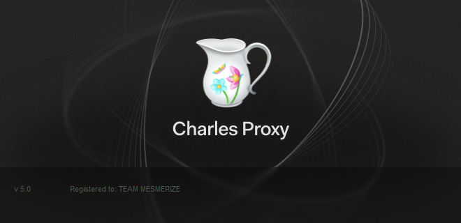
  
Рисунок 1

Charles Web Debugging Proxy - это инструмент мониторинга HTTP и HTTPS трафика. Он выступает в роли прокси-сервера (промежуточного звена) между тестируемым приложением и сервером на бэкенде, позволяя не только видеть, но также перехватывать и редактировать запросы.

Главное преимущество Charles Proxy и снифферов в целом - возможность просмотра трафика, в том числе с мобильных устройств, что значительно облегчает работу тестировщика клиент-серверных мобильных приложений.

## **Начало работы**

### **Установка**

Web сайт - Charles Web Debugging Proxy https://www.charlesproxy.com/

На Рисунке 2.1.1 окно установки Charless. По умолчанию отмечен чекбокс запуска приложения, после окончания инсталяции, остовляем его отмеченым и нажимаем установить.

 

  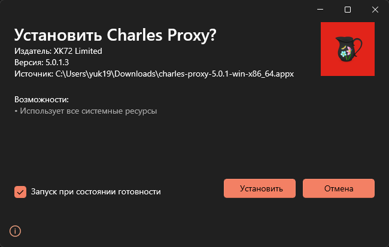
  
Рисунок 2.1.1

### **Первый запуск**

1. При первом запуске **разрешить доступ к сетям**, в окне безопасности нажать кнопку “Разрешить” Рисунок 2.2.1

  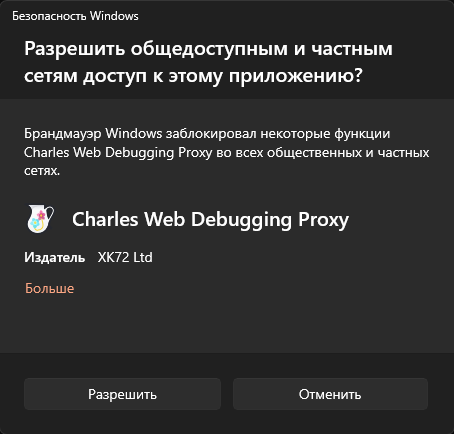
  
Рисунок 2.2.1

> ### ℹ Информация
>
> Дополнительные сертификаты нужно установить на сам ПК.

2.  Для скачивания и установки перейти Help -> SSL Proxying -> Install Charles Root Certificate. Рисунок 4

  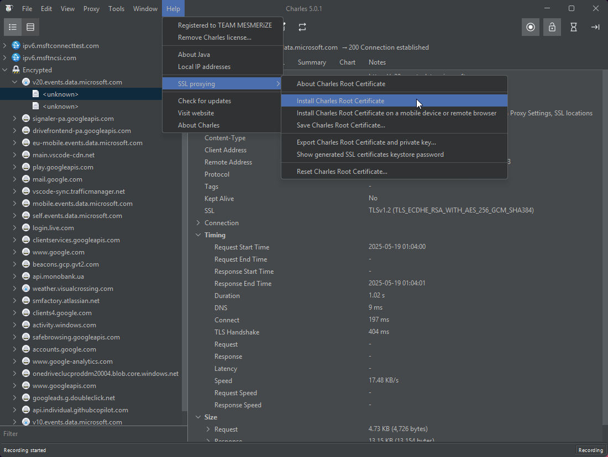
  
Рисунок 2.2.2

3. В открывшемся окне “Сертификат” нажать на кнопку “Установить сертификат…” Рисунок 5

  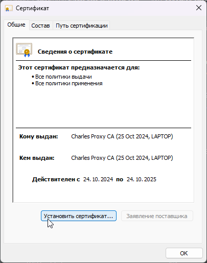
  
Рисунок 2.2.3

4. В мастере импорта сертификатов выбрать расположение хранилища “Текущий пользователь” и нажать “Далее” Рисунок 6

  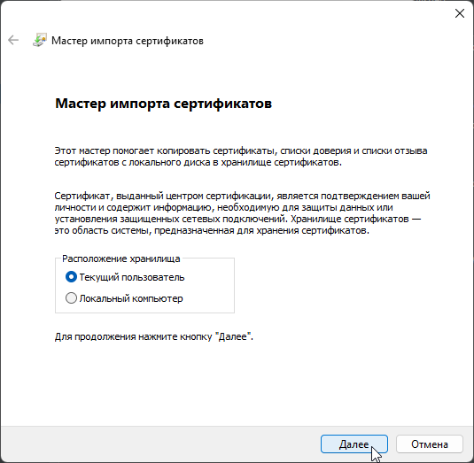
  
Рисунок 2.2.4

5. Выбрать хранилище сертификатов “Поместить все сертификаты в следующее хранилище” нажать “Обзор” Рисунок 7 

  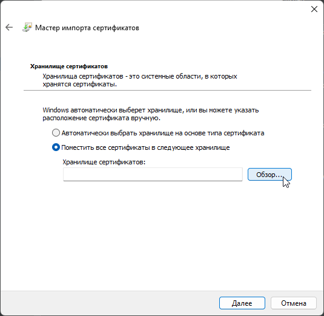
  
Рисунок 2.2.5

6. В списке выбрать хранилище “Доверенные корневые центры сертификации“, нажать “ОК” => “Далее”.    Рисунок 8

  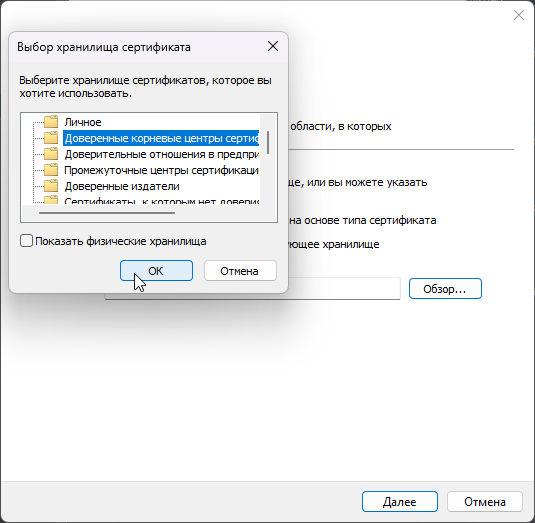
  
Рисунок 2.2.6

7. В окне мастера нажать "Далее"

  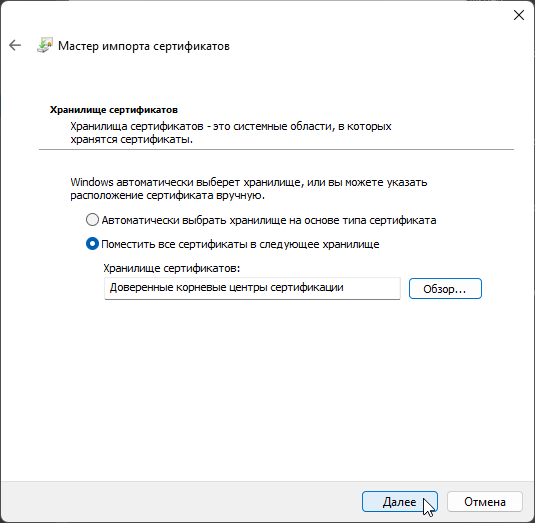
  
Рисунок 2.2.7

8. Для завершения работы мастера сертификатов, нажать “Готово”. Рисунок 9

  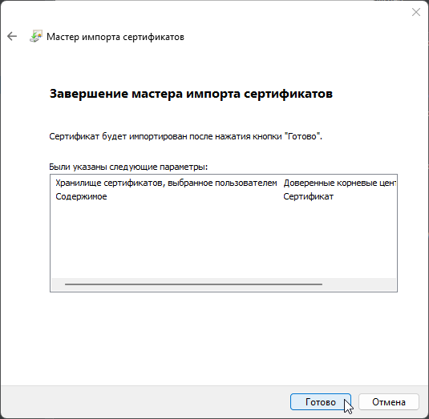
  
Рисунок 2.2.8

9. Сертификат установлен нажать “ОК” => “ОК”. Рисунок 10

  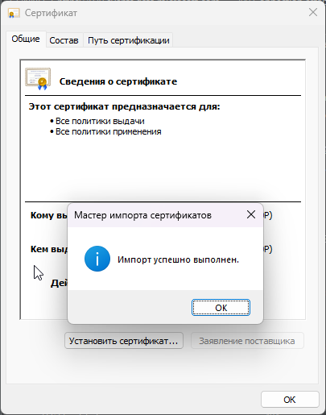
  
Рисунок 2.2.9

### **Интерфейс**

  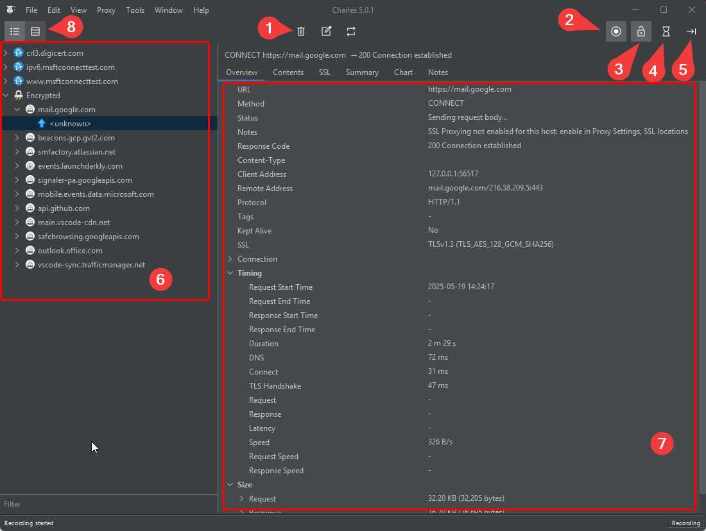
  
Рисунок -

- **① - Clear the current Session** — очищает историю запросов.
- **② - Start/Stop Recording** — включает или выключает записи запросов.
- **③ - Start/Stop SSL Proxying** — включает или выключает просмотр запросов.
- **④ - Start/Stop Throttling** — включает или выключает троттлинг соединения.
- **⑤ - Enable/Disable Breakpoints** — включает или выключает брейкпоинты по запросам.

Интерфейс Charles Proxy прост. Слева - ⑥ - список перехваченных запросов, справа ⑦ - детали.

В списке запросов есть две основные вкладки - ⑧ Structure и Sequence.

В первом случае запросы рассортированы по хостам-папкам. Наведя на любой из них, можно получить всю информацию о количестве запросов к этому корневому хосту, доле удачных, таймингах, размерах и т.п. Фактически, здесь представлена вся та же информация, которую можно получить из панели разработчика в браузере. Выбрав конкретный URL, можно увидеть код ответа, версии протоколов, контент и т.п. Тело запроса, заголовки, cookie (если есть) можно посмотреть в разных форматах - даже в HEX.

На вкладке Sequence запросы выведены по времени в виде настраиваемой таблицы. Видно, когда начался запрос, сколько он длился, его размер, статус и т.п. Наведя на конкретную строку, мы получим ту же информацию о теле, заголовках и т.п.

Если запросов на экране слишком много, с помощью панели инструментов их можно очистить или вообще остановить перехват. Там же есть возможность включить и выключить тротлинг (подробнее об этих функциях расскажу позже). Базовая настройка каждой из функций осуществляется через меню, а кнопки панели управления выступают своего рода тумблерами On / Off.

В Charles Proxy очень много вариантов фильтрации запросов.

Начнем с вкладки Structure. Самое примитивное - скопировать хост и вставить в поле Filter. Так мы увидим только запросы с этого хоста. Примерно того же результата можно добиться, если в контекстном меню хоста выбрать Focus. Остальные запросы будут собраны в Other Hosts. Если при этом перейти на закладку Sequence и отметить настройку Focused, то в списке окажется информация только о тех запросах, которые были выбраны на вкладке Structure.

На вкладке Sequence есть аналогичный фильтр.

## **Функциональность Charles Proxy**

### **Включение SSL Proxying**

#### **Focus**

Для удобства работы с выбранным хостом, делаем на нем фокус — эта функция перемещает домен на первые позиции в списке. Открыть контекстное меню выбранного хоста, выбрать пункт меню “Focus”

  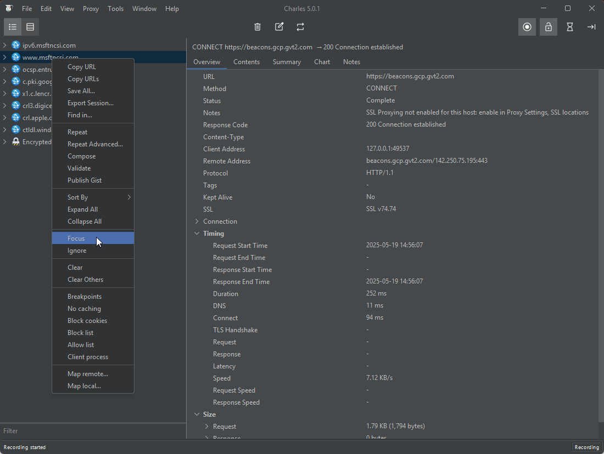
  
Рисунок -

#### **SSL Proxying**

Просмотр SSL-трафика. Открыть контекстное меню выбранного хоста, выбрать пункт меню “Enable SSL Proxying”

Если ранее мы успешно установили SSL-сертификат, для просмотра зашифрованного трафика остается только включить SSL proxying для нужного хоста в самом Charles Proxy.

  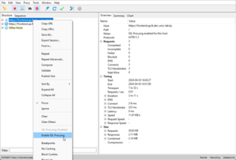
  
Рисунок -

#### **Дополнительный функционал**

##### **Breakpoints**

Брекпоинты - это настройка точек остановки, которые позволяют перехватывать запросы.

> ### ⚠️ Внимание
>
> Перехватывает **все** запросы, с этой настройкой будет сложно выбрать нужный запрос

a. Установить Breakpoint можно из контекстного меню запроса. После этого **все** аналогичные запросы будут перехвачены. Их можно будет просматривать и редактировать.

  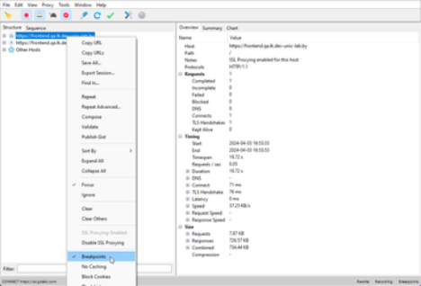
  
Рисунок -

> ### ℹ Информация
>
> Чтобы проверить, как это работает можно использовать повтор запроса (Repeat из того же контекстного меню или обновить страницу). Запрос перехватывается, его можно редактировать.

##### **Repeat**

**Repeat** — отправляет на сервер запрос, идентичный выбранному.

##### **Repeat Advanced**

**Repeat Advanced** — идентично Repeat, только можно выбрать количество отправляемых запросов и задержку между ними. Эта функция пригодится при проверке реакции сервера на флуд.

### **Proxy**

#### **SSL Proxying Settings…**

Чтобы не включать каждый хост, можно зайти в Proxy => SSL Proxying settings и на первой вкладке SSL Proxying включить Enable SSL Proxying.

  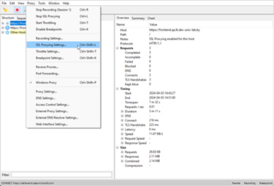
  
Рисунок -

На вкладках Include и Exclude можно добавить или исключить конкретные хосты. Если списки на этих вкладках не заполнять, по умолчанию мы будем читать трафик со всех хостов.

  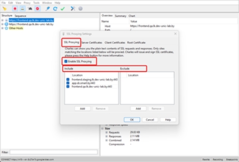
  
Рисунок -

#### **Breakpoint Settings…**

Чтобы не перехватывать все запросы, а только те, которые нам нужны, настраиваем “Breakpoint Settings…”

- Скопировать выбранный адрес запроса

  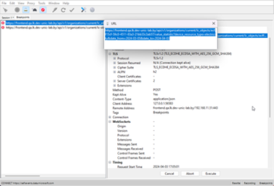
  
Рисунок -

- Для перехода к настройкам, выбрать пункт меню Proxy => Breakpoint Settings… Рисунок 18

  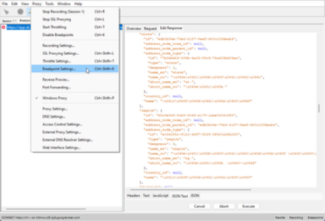
  
Рисунок -

- Для включения установить чек-бокс ☑“Enable Breakpoints”

  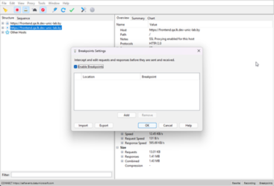
  
Рисунок -

- В окне “Breakpoints Settings” Нажать на кнопку “Add” для добавления новых правил. В окне “Edit Breakpoint” вставить скопированный URL в ячейку Host

  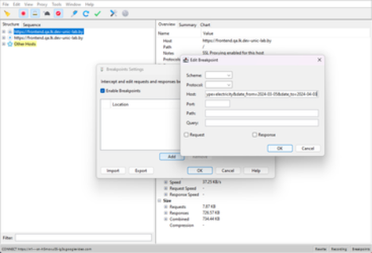
  
Рисунок -

- После вставки URL нажать на кнопку TAB для автоматического заполнения полей

  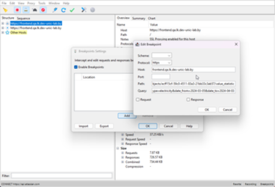
  
Рисунок -

- Поле Query очистить и установить чек-бокс “Response” нажать ”ОК”

> ### ℹ Информация
>
> Устанавливать можно одновременно оба чек-бокса “Response” и ”Request”. Обработан будет только один вид, если изменить запрос, ответ не будет доступен для просмотра, если запрос не изменять, ответ будет доступен для просмотра и редактирован

  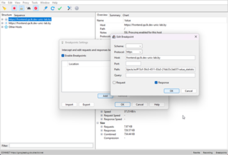
  
Рисунок -

- Новое правило добавлено, для сохранения выбранных параметров в окне “Breakpoints Settings” нажать на кнопку “ОК”

> ### ℹ Информация
>
> В “Breakpoints Settings” можно добавлять разные правила для разных страниц. Каждое правило можно отключить не зависимо от других

  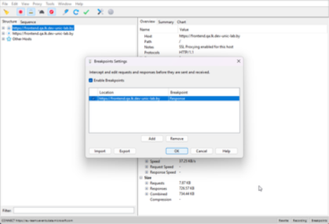
  
Рисунок -

> ### ⚠️ Внимание
>
> Обратите внимание, в левом нижнем углу есть кнопки Import и Export. Они позволяют обмениваться настройками - переносить их с одного рабочего места на другое.

- Пример редактирования ответа

  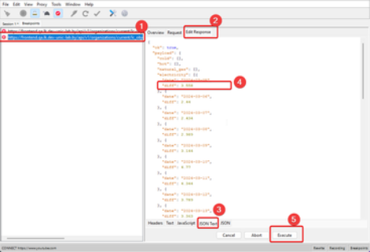
  
Рисунок -

Пример редактирования запроса на вкладке **Breakpoints**

1. Выбрать нужный запрос
1. перейти на вкладку “Edit Response”
1. Выбрать вид отображения “JSON Text”
1. Отредактировать запрос (изменить 3,558 на 25,25)
1. Нажать “Execute”

Пример ответа после редактирования

  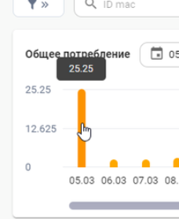
  
Рисунок -

> ### ℹ Информация
>
> В принципе, изменить можно все - от header до токена авторизации. Когда редактирование будет закончено, можно выбрать Execute и в Charles Proxy появится повторный запрос, который и отправится на сервер, а потом вернется с ответом. В этот момент можно будет посмотреть и отредактировать ответ, который получит приложение - появится поле Edit response.

#### **Throttle Settings**

**Throttle Settings** — функция, позволяющая задавать разные параметры скорости соединения с выбранным доменом.

Перейдем в **Proxy** → **Throttle Settings** → галочка **Enable Throttling**. Если не разбираетесь во всех перечисленных пунктах, то можете использовать Throttle preset и там выбрать подходящую для теста скорость, а система автоматически заполнит остальные поля.

  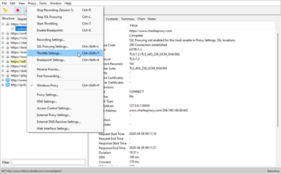
  
Рисунок -

  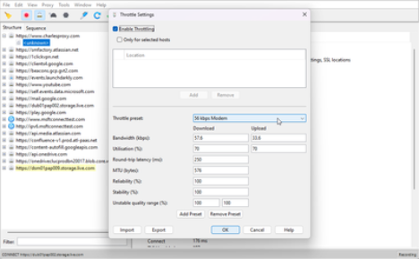
  
Рисунок -

#### **Reverse Proxies**

**Reverse proxy** — обратный прокси-сервер. Обычно используется для того, чтобы принимать запросы из Интернета и перенаправлять их на один из веб-серверов.

#### **Port Forwarding**

**Port Forwarding** — проброс портов, который иногда называют перенаправлением портов, или туннелированием — процесс пересылки трафика, адресованного конкретному сетевому порту, с одного сетевого узла на другой. Этот метод позволяет внешнему пользователю достичь порта внутри локальной сети.

#### **Windows Proxy**

**Windows Proxy** — проксирование трафика с вашего веб-браузера.

### **Tools**

#### **Map Local**

В Map Local замена осуществляется на содержимое локального файла. В настройках вместо второго сервера мы указываем локальный путь к файлу с ответом.

- Для настройки Map Local перейти Tools => Map local…

  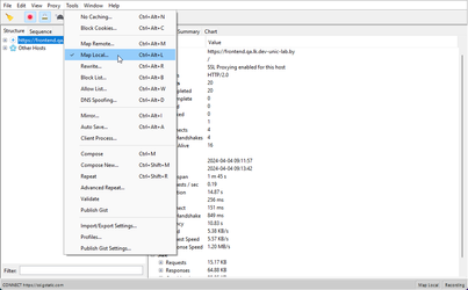
  
Рисунок -

- Для включения Map Location, в окне Map Local Settings установить чек-бокс ☑ **Enable Map Local**

  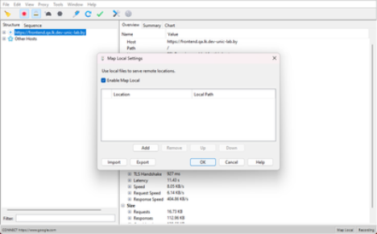
  
Рисунок -

> ### ⚠️ Внимание
>
> Обратите внимание, в левом нижнем углу есть кнопки Import и Export. Они позволяют обмениваться настройками - переносить их с одного рабочего места на другое.

- Для добавления нового правила нажать на кнопку Add, откроется новое окно Edit Mapping.
  - Вставить в поле Host скопированный URL
  - Нажать TAB для заполнения необходимых полей
  - Очистить поле Query
  - В поле Local path указать путь к файлу с ответом, для выбора файла нажать Choose и выбрать расположение файла.
  - Нажать кнопку “ОК” для сохранения параметров

  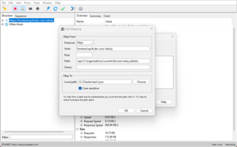
  
Рисунок -

#### **Rewrite**

**Rewrite** — это инструмент, позволяющий создавать правила, которые изменяют запросы и ответы, когда те проходят через Charles Proxy. Например, можно добавлять и изменять заголовок, искать и заменять текст в теле ответа или запроса, и т.д.

Для включения и создания правил открыть **Tools** → **Rewrite** → галочка «**Enable Rewrite**» → **Add**. В поле **Name** можно ввести любое название подмены, либо оставить по умолчанию «Untitled Set».

  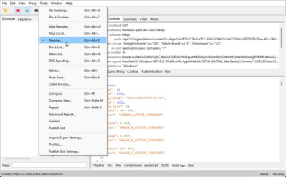
  
Рисунок -

Следующим шагом необходимо добавить в «Location» путь запроса. Для этого, в разделе **Location** → **Add** заполните следующие поля и сохраните:\
**Host:** \
**Path:**

  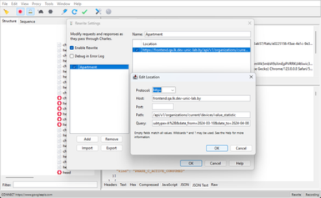
  
Рисунок -

После того, как добавили путь запроса, необходимо изменить сам параметр и его значение. Для этого нужно создать **Rewrite Rule**:

**Type:** Body (потому что параметр находится в теле);

**Where:** Response (потому что параметр находится в ответе от сервера);

**Раздел Match:** в «Value» укажите значение и параметр, который возвращает сервер;

**Раздел Replace:** в «Value» укажите значение и параметр, который вы хотите увидеть на клиенте.

Пример: Рисунок 34, Рисунок 35

> ### ℹ Информация
>
> Если поле Value в разделе Match оставить пустым, то весь ответ будет заменен на значение поля Value в разделе Replace

  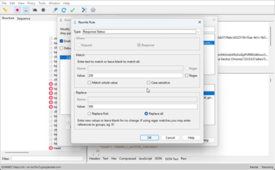
  
Рисунок -

  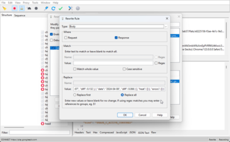
  
Рисунок -

#### **Map Remote**

**Map Remote** — позволяет переадресовать запросы с одного URL «Map From» на другой «Map To». Подменяет хост, путь целиком или только параметры в зависимости от вашей задачи. В примере ниже подменён запрос с prod-сервера на dev-сервер.

  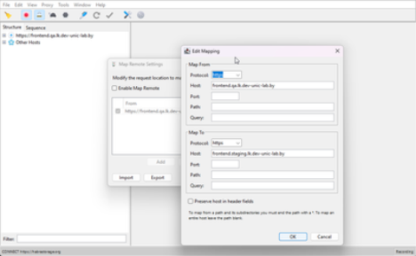
  
Рисунок -

#### **Block List**

**Block List** — позволяет блокировать определённые доменные имена. Когда веб-браузер попытается запросить любую страницу из заблокированного доменного имени, она заблокируется. Можно выбрать либо «Drop connection», либо возврат 403 ошибки.

#### **No Caching**

Инструмент **No Caching** предотвращает кэширование, манипулируя заголовками HTTP, которые управляют кэшированием ответов. Заголовки If-Modified-Since и If-None-Match удаляются из запросов, добавляются Pragma: no-cache и Cache-control: no-cache. Заголовки Expires, Last-Modified и ETag удаляются из ответов и добавляются Expires: 0 и Cache-Control: no-cache.

  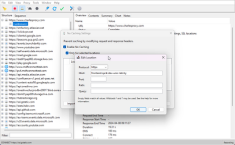
  
Рисунок -

#### **Block Cookies**

**Block Cookies** — заголовок файла Cookie удаляется из запросов, предотвращая отправку значений файла из клиентского приложения (например веб-браузер) на удаленный сервер. А также из ответов удаляется заголовок Set-Cookie, предотвращая получение клиентским приложением запросов на установку файлов cookie с удаленного сервера. В настройках можно включить удаление Cookie как для всех хостов, так и для выбранных. В примере ниже включено удаление Cookie для всех запросов.

  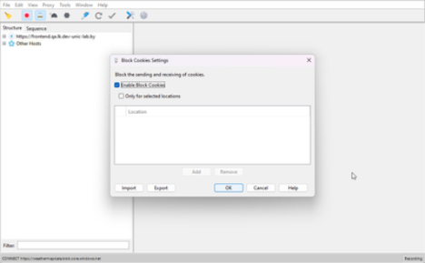
  
Рисунок -

#### **DNS Spoofing**

Виртуальный хостинг — это когда у вас есть несколько сайтов на одном IP-адресе, и веб-сервер определяет, какой сайт вы запрашиваете, основываясь на имени, введённом в браузере. Точнее, сервер смотрит на заголовок хоста, отправленный в запросе. Например, когда нужно подменить хосты, чтобы при вводе какого-либо адреса в браузере (скажем, <http://api.youla.ru> ) запросы уходили по другому адресу (допустим, на тестовую площадку).

#### **Mirror**

**Mirror** — эта функция позволяет автоматически сохранять все ответы, возвращаемые в Charles Proxy. Они раскладываются локально в такой же иерархии, как на сервере. Если внезапно случился даунтайм на бэкенде, отвалилась тестовая среда и т. д., у вас уже есть готовые моки для Map Local. Активировать функцию можно так: **Tools** → **Mirror** или **Tools** → **Auto Save**.

#### **Compose**

**Compose** — функция редактирования запросов, которые вы поймали.

Например вы добавляете в избранное какой-то товар, но почему-то он не добавляется. Вы можете отредактировать уже отправленный запрос и отправить его еще раз. Для этого необходимо выбрать нужный запрос из списка, нажать на нём правой кнопкой и выбрать **Compose**. Иконка у запроса поменяется, и теперь можно смело его редактировать.

После того, как вы изменили нужные значения в запросе, нажмите внизу «Execute», чтобы отправить запрос на сервер.

### **Settings**

#### **Recording Settings**

**Recording Settings** — настройки отображения списков разрешенных и запрещенных доменов.

Во вкладке «Options» можно настроить лимит, то есть количество запросов, которое Charles Proxy может записать.

  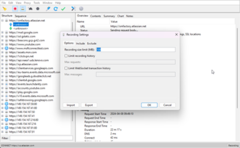
  
Рисунок -

Во вкладке «Include» можно выбрать конкретный домен для отображения пакетов.

  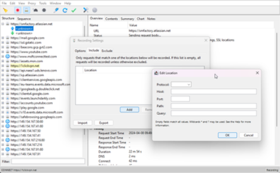
  
Рисунок -

Во вкладке «Exclude» можем выбрать те домены, которые необходимо спрятать при сниффинге.

  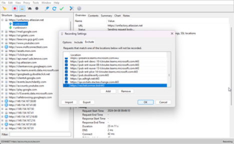
  
Рисунок -

## **Резюме**

Конечно, список функций Charles Proxy этим не ограничивается. Есть еще много полезного - от перенаправления доменного имени на другой IP-адрес, до автоматического сохранения полученных ответов.

Отмечу, что Charles Proxy платный. Можно использовать триальную версию. Но раз в 5-7 минут поверх него будет отображаться всплывающее окно с версией, а раз в 30 минут он будет выключаться, при этом сессии не сохраняются. Решайте сами, помешает ли это вашей работе.

В целом Charles Proxy - это хороший инструмент.
