### [ ◀️ Технические гайды и инструкции](../README.md)

# **Charles**

### **Оглавление**

- [**Charles**](#charles)
  - [**Оглавление**](#оглавление)
  - [**O Charles Proxy**](#o-charles-proxy)
  - [**Начало работы MacOS**](#начало-работы-macos)
    - [**Установка**](#установка)
    - [**Регистрация**](#регистрация)
    - [**Установка сертификата**](#установка-сертификата)
  - [**Начало работы Windows**](#начало-работы-windows)
    - [**Установка**](#установка-1)
    - [**Первый запуск**](#первый-запуск)
    - [**Интерфейс**](#интерфейс)
  - [**Функциональность Charles Proxy**](#функциональность-charles-proxy)
    - [**Включение SSL Proxying**](#включение-ssl-proxying)
      - [**Включение Proxy**](#включение-proxy)
      - [**Focus**](#focus)
      - [**SSL Proxying**](#ssl-proxying)
      - [**Дополнительный функционал**](#дополнительный-функционал)
        - [**Breakpoints**](#breakpoints)
        - [**Repeat**](#repeat)
        - [**Repeat Advanced**](#repeat-advanced)
    - [**Proxy**](#proxy)
      - [**SSL Proxying Settings…**](#ssl-proxying-settings)
      - [**Breakpoint Settings…**](#breakpoint-settings)
      - [**Throttle Settings**](#throttle-settings)
      - [**Reverse Proxies**](#reverse-proxies)
      - [**Port Forwarding**](#port-forwarding)
      - [**Windows Proxy**](#windows-proxy)
    - [**Tools**](#tools)
      - [**Map Local**](#map-local)
      - [**Rewrite**](#rewrite)
      - [**Map Remote**](#map-remote)
      - [**Block List**](#block-list)
      - [**No Caching**](#no-caching)
      - [**Block Cookies**](#block-cookies)
      - [**DNS Spoofing**](#dns-spoofing)
      - [**Mirror**](#mirror)
      - [**Compose**](#compose)
    - [**Settings**](#settings)
      - [**Recording Settings**](#recording-settings)
  - [**Резюме**](#резюме)

<!-- разделитель -->

---

## **O Charles Proxy**

Снифферы - это инструменты, позволяющие перехватывать, анализировать и модернизировать все запросы, которые через них проходят. Они полезны, когда из потока нужно извлечь какие-либо сведения или создать нужный ответ сервера. Так можно проводить модульное тестирование продукта, в котором есть и бэк, и фронт, и разные команды со своей версионностью.

  
  
Рисунок 1

Charles Web Debugging Proxy - это инструмент мониторинга HTTP и HTTPS трафика. Он выступает в роли прокси-сервера (промежуточного звена) между тестируемым приложением и сервером на бэкенде, позволяя не только видеть, но также перехватывать и редактировать запросы.

Главное преимущество Charles Proxy и снифферов в целом - возможность просмотра трафика, в том числе с мобильных устройств, что значительно облегчает работу тестировщика клиент-серверных мобильных приложений.

## **Начало работы MacOS**

### **Установка**

1. Загрузите установочный файл с Web сайта - [Charles Web Debugging Proxy](https://www.charlesproxy.com/). Запустите установочный файл и переместите `Charles` в папку `Applications`, Рисунок 2

  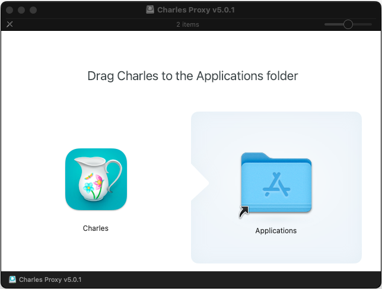
  
Рисунок 2

2. По окончании установки подтвердите лицензионное соглашение нажав кнопку `Agree`.

  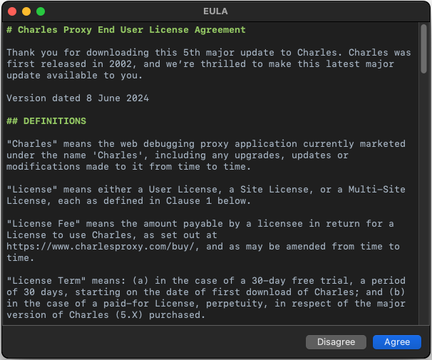
  
Рисунок 3

3. Для автоматической настройки сетей для использования с Charles, необходимо предоставить привилегии приложению Charles Proxy Settings, для этого нужно нажать на кнопку `Grant Privileges`.

  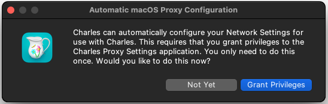
  
Рисунок 4

4. Введите свой пароль для того чтобы Charles установил новый инструмент.

  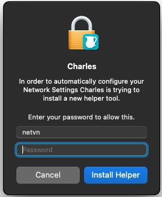
  
Рисунок 5

### **Регистрация**

1. Для регистрации Charlies перейти по пути `Help` => `Enter Charles License...`, пример на рисунке 6

  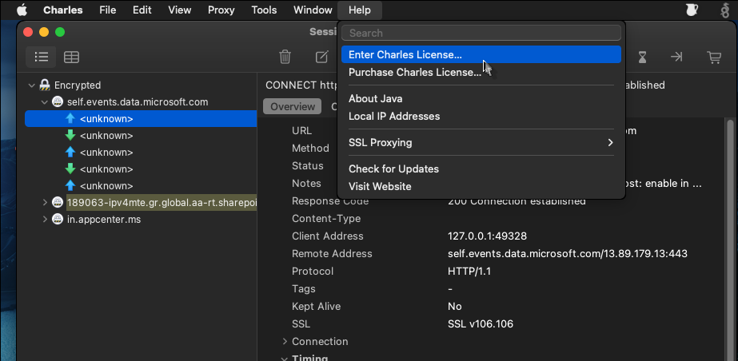
  
Рисунок 6

2. В открывшемся окне ввести регистрационное имя и лицензионный ключ. Рисунок 7

  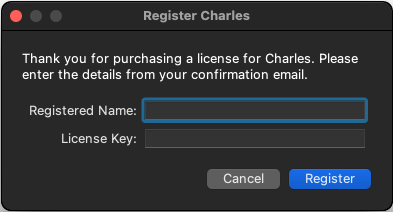
  
Рисунок 7

3. После внесения регистрационных данных, нажать на кнопку `Register`, для регистрации продукта.

  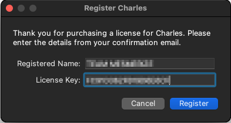
  
Рисунок 8

4. После успешной регистрации в открывшемся окне нажать `OK`, приложение будет закрыто.

  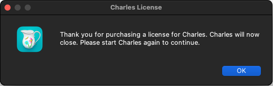
  
Рисунок 9

5. После закрытия приложения, откройте его снова. Регистрация окончена, данные о регистрации можно просмонтреть пройдя по пути `Help` => `Registered to {Registered Name}` Рисунок 10.

  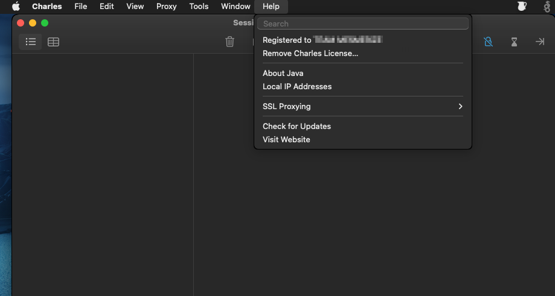
  
Рисунок 10

### **Установка сертификата**

1. Для установки сертификата Charlies перейти по пути `Help` => `Install Charles Root Certificate`, пример на рисунке 11

  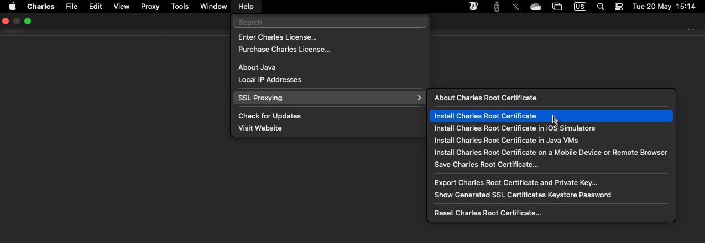
  
Рисунок 11

2. В открывшемся окне "Keychain Access" откройте сертификат `Charles Proxy CA`, пример на рисунке 12

  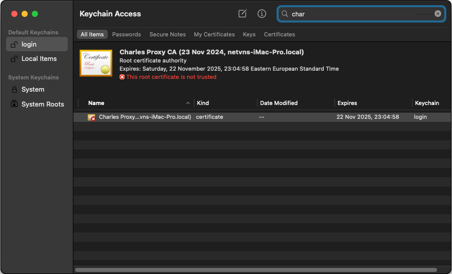
  
Рисунок 12

3. В окне сертифаката установите все разрешения в состояние `Always Trust` и закройте окно.

  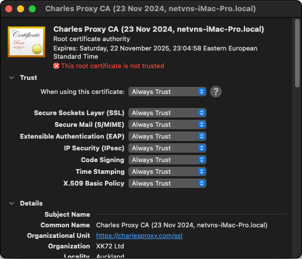
  
Рисунок 13

4. Этот сертификат `Charles Proxy CA` отмечен как доверенный для этой учетной записи.

  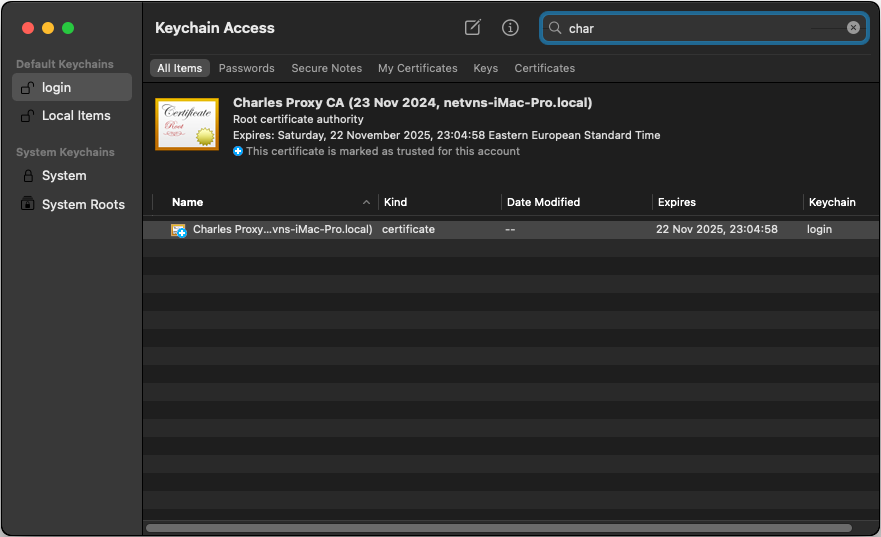
  
Рисунок 14

## **Начало работы Windows**

### **Установка**

Web сайт - Charles Web Debugging Proxy https://www.charlesproxy.com/

На Рисунке 15 окно установки Charless. По умолчанию отмечен чекбокс запуска приложения, после окончания инсталяции, остовляем его отмеченым и нажимаем установить.

 

  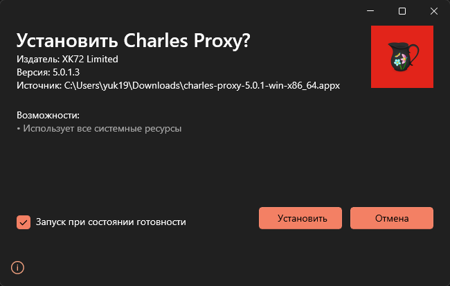
  
Рисунок 15

### **Первый запуск**

1. При первом запуске **разрешить доступ к сетям**, в окне безопасности нажать кнопку “Разрешить” Рисунок 16

  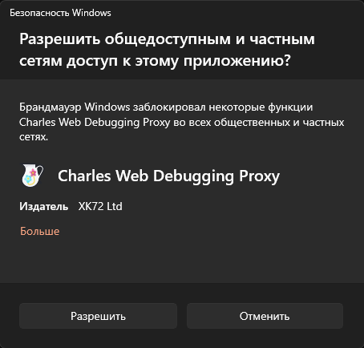
  
Рисунок 16

> **ℹ️ Информация**
>
> Дополнительные сертификаты нужно установить на сам ПК.

2.  Для скачивания и установки перейти Help -> SSL Proxying -> Install Charles Root Certificate. Рисунок 17

  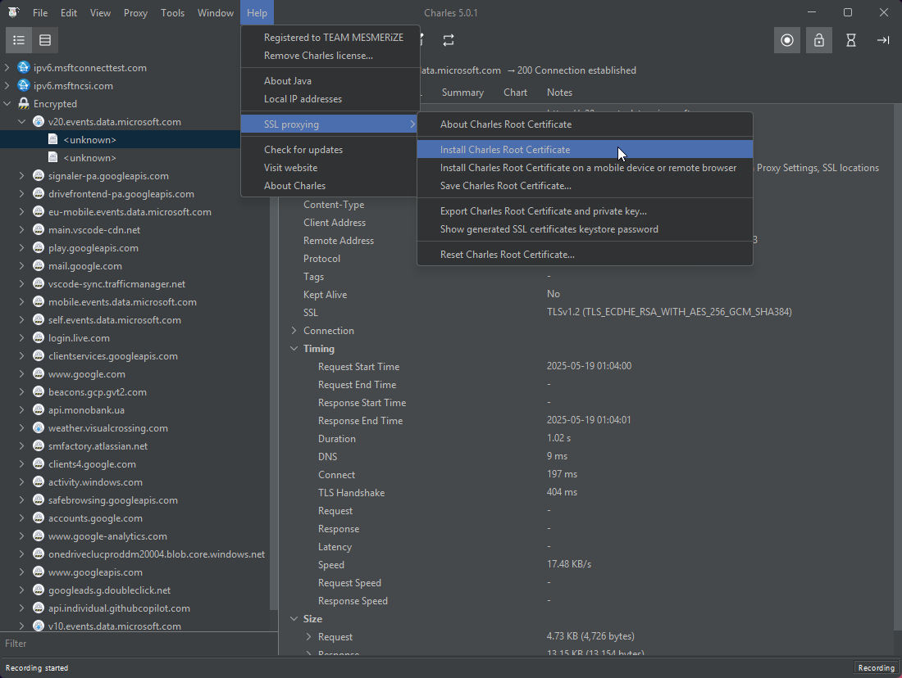
  
Рисунок 17

3. В открывшемся окне “Сертификат” нажать на кнопку “Установить сертификат…” Рисунок 18

  
  
Рисунок 18

4. В мастере импорта сертификатов выбрать расположение хранилища “Текущий пользователь” и нажать “Далее” Рисунок 19

  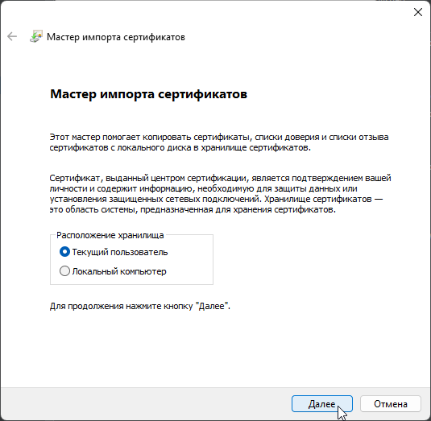
  
Рисунок 19

5. Выбрать хранилище сертификатов “Поместить все сертификаты в следующее хранилище” нажать “Обзор” Рисунок 20

  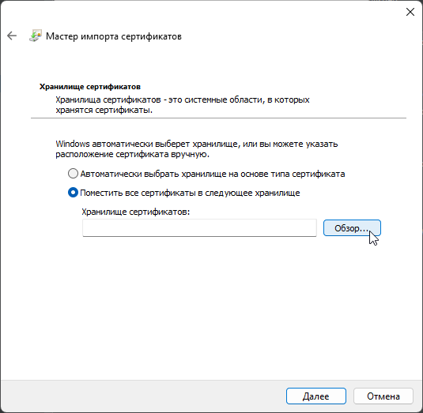
  
Рисунок 20

6. В списке выбрать хранилище “Доверенные корневые центры сертификации“, нажать “ОК” => “Далее”.    Рисунок 21

  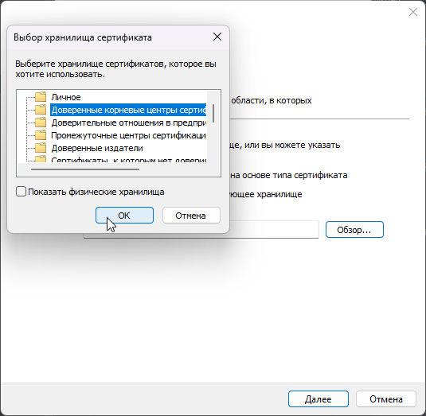
  
Рисунок 21

7. В окне мастера нажать "Далее"

  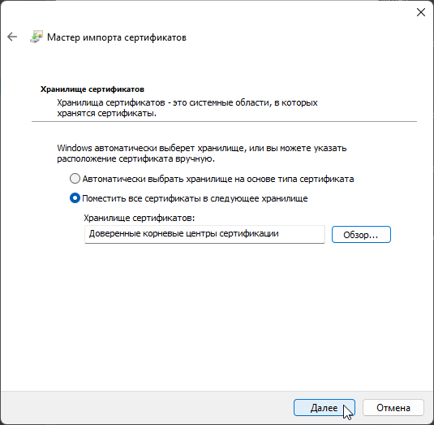
  
Рисунок 22

8. Для завершения работы мастера сертификатов, нажать “Готово”. Рисунок 23

  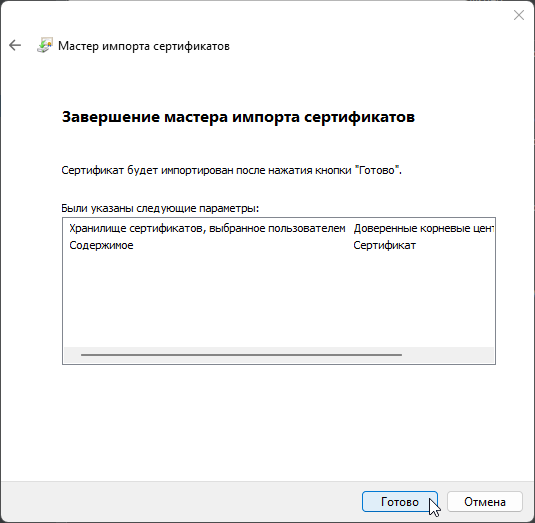
  
Рисунок 23

9. Сертификат установлен нажать “ОК” => “ОК”. Рисунок 24

  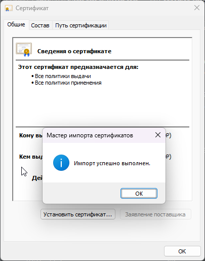
  
Рисунок 24

### **Интерфейс**

  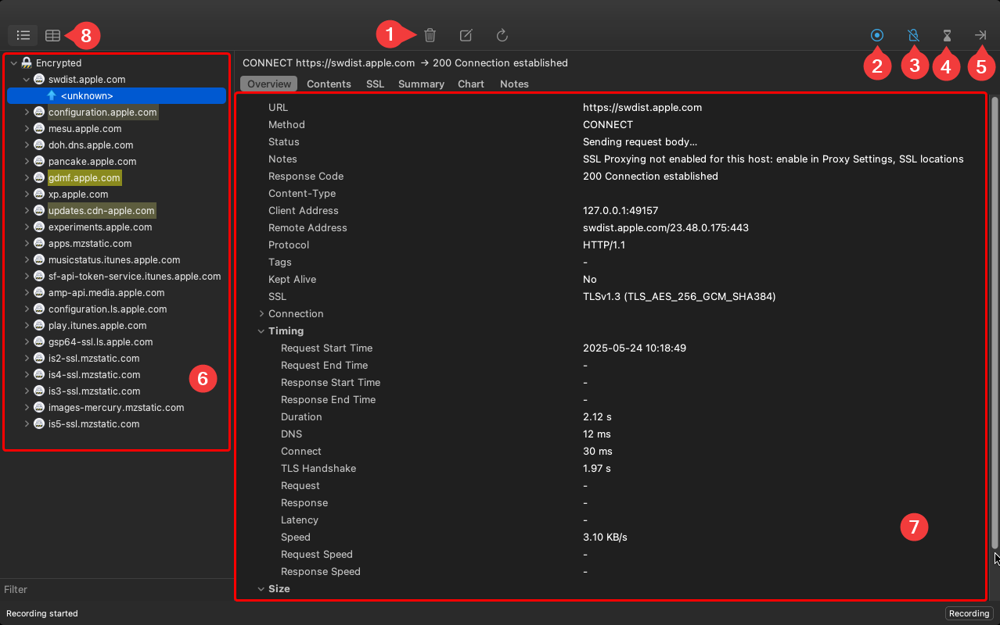
  
Рисунок 25

- **① - Clear the current Session** — очищает историю запросов.
- **② - Start/Stop Recording** — включает или выключает записи запросов.
- **③ - Start/Stop SSL Proxying** — включает или выключает просмотр запросов.
- **④ - Start/Stop Throttling** — включает или выключает троттлинг соединения.
- **⑤ - Enable/Disable Breakpoints** — включает или выключает брейкпоинты по запросам.

Интерфейс Charles Proxy прост. Слева - ⑥ - список перехваченных запросов, справа ⑦ - детали.

В списке запросов есть две основные вкладки - ⑧ Structure и Sequence.

В первом случае запросы рассортированы по хостам-папкам. Наведя на любой из них, можно получить всю информацию о количестве запросов к этому корневому хосту, доле удачных, таймингах, размерах и т.п. Фактически, здесь представлена вся та же информация, которую можно получить из панели разработчика в браузере. Выбрав конкретный URL, можно увидеть код ответа, версии протоколов, контент и т.п. Тело запроса, заголовки, cookie (если есть) можно посмотреть в разных форматах - даже в HEX.

На вкладке Sequence запросы выведены по времени в виде настраиваемой таблицы. Видно, когда начался запрос, сколько он длился, его размер, статус и т.п. Наведя на конкретную строку, мы получим ту же информацию о теле, заголовках и т.п.

Если запросов на экране слишком много, с помощью панели инструментов их можно очистить или вообще остановить перехват. Там же есть возможность включить и выключить тротлинг (подробнее об этих функциях расскажу позже). Базовая настройка каждой из функций осуществляется через меню, а кнопки панели управления выступают своего рода тумблерами On / Off.

В Charles Proxy очень много вариантов фильтрации запросов.

Начнем с вкладки Structure. Самое примитивное - скопировать хост и вставить в поле Filter. Так мы увидим только запросы с этого хоста. Примерно того же результата можно добиться, если в контекстном меню хоста выбрать Focus. Остальные запросы будут собраны в Other Hosts. Если при этом перейти на закладку Sequence и отметить настройку Focused, то в списке окажется информация только о тех запросах, которые были выбраны на вкладке Structure.

На вкладке Sequence есть аналогичный фильтр.

## **Функциональность Charles Proxy**

### **Включение SSL Proxying**

#### **Включение Proxy**

Для включения перехвата запросов, нужно включить `macOS Proxy` или `Windows Proxy` соответственно, перейдя к пункту меню `Proxy`=>`macOS Proxy`

 

  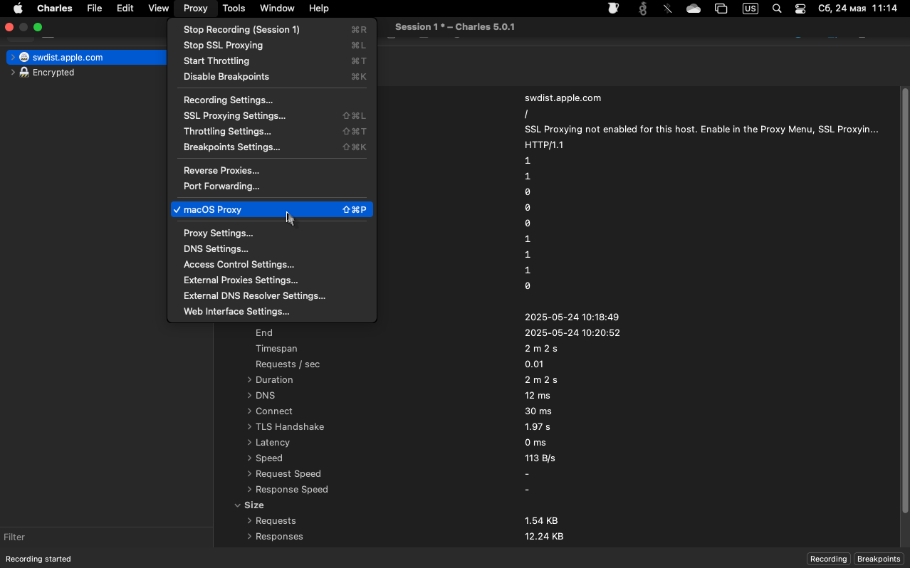
  
Рисунок 26

#### **Focus**

Для удобства работы с выбранным хостом, делаем на нем фокус — эта функция перемещает домен на первые позиции в списке. Открыть контекстное меню выбранного хоста, выбрать пункт меню “Focus”

  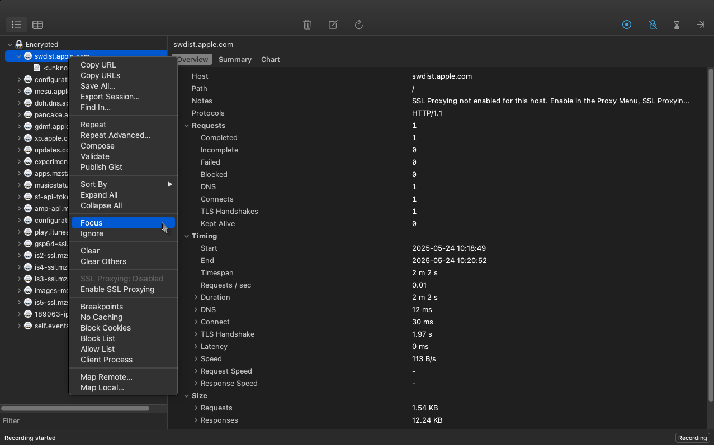
  
Рисунок 27

#### **SSL Proxying**

Просмотр SSL-трафика. Открыть контекстное меню выбранного хоста, выбрать пункт меню “Enable SSL Proxying”

Если ранее мы успешно установили SSL-сертификат, для просмотра зашифрованного трафика остается только включить SSL proxying для нужного хоста в самом Charles Proxy.

  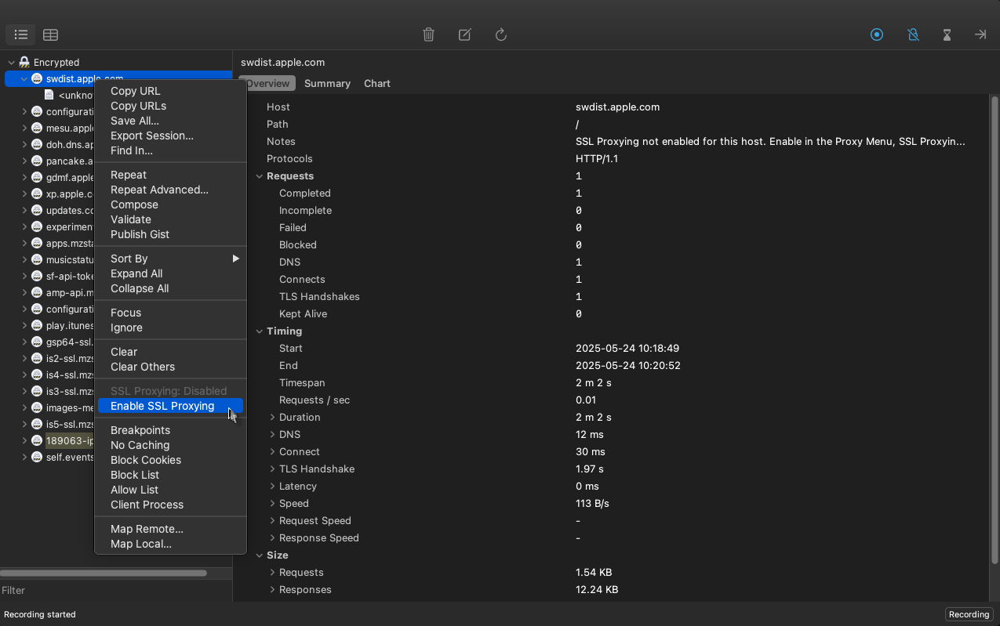
  
Рисунок 28

#### **Дополнительный функционал**

##### **Breakpoints**

Брекпоинты - это настройка точек остановки, которые позволяют перехватывать запросы.

> **⚠️ Внимание**
>
> Перехватывает **все** запросы, с этой настройкой будет сложно выбрать нужный запрос

a. Установить Breakpoint можно из контекстного меню запроса. После этого **все** аналогичные запросы будут перехвачены. Их можно будет просматривать и редактировать.

  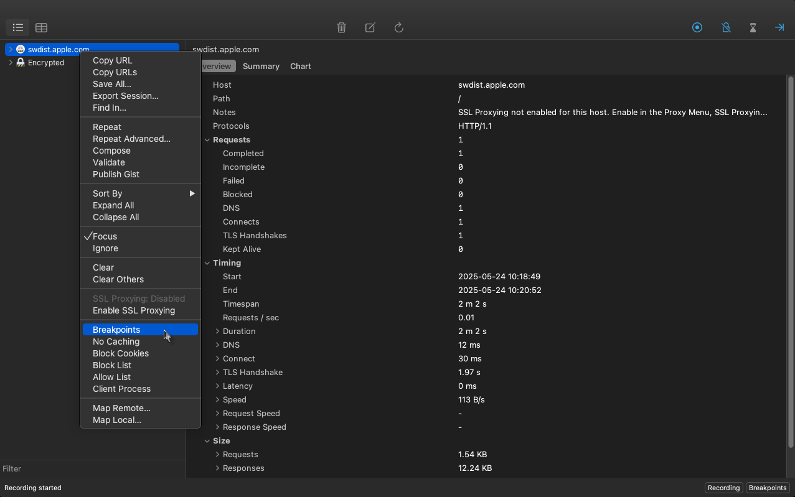
  
Рисунок 29

> **ℹ️ Информация**
>
> Чтобы проверить, как это работает можно использовать повтор запроса (Repeat из того же контекстного меню или обновить страницу). Запрос перехватывается, его можно редактировать.

##### **Repeat**

**Repeat** — отправляет на сервер запрос, идентичный выбранному.

##### **Repeat Advanced**

**Repeat Advanced** — идентично Repeat, только можно выбрать количество отправляемых запросов и задержку между ними. Эта функция пригодится при проверке реакции сервера на флуд.

### **Proxy**

#### **SSL Proxying Settings…**

Чтобы не включать каждый хост, можно зайти в Proxy => SSL Proxying settings и на первой вкладке SSL Proxying включить Enable SSL Proxying.

  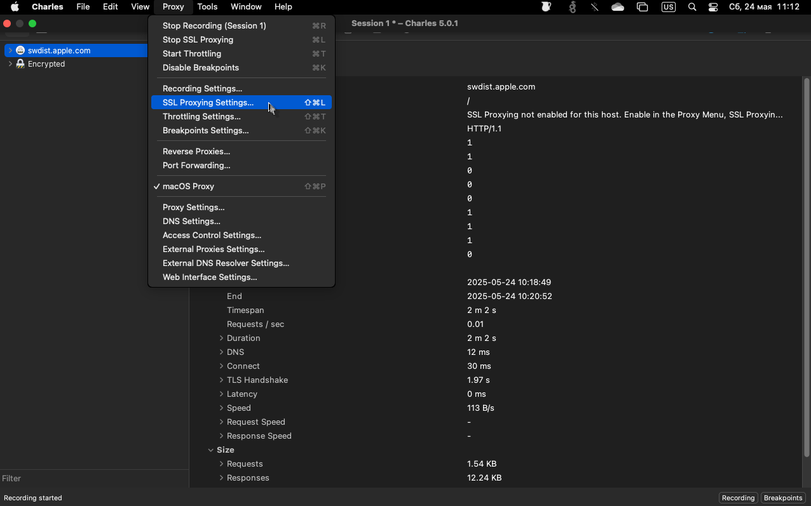
  
Рисунок 30

На вкладках Include и Exclude можно добавить или исключить конкретные хосты. Если списки на этих вкладках не заполнять, по умолчанию мы будем читать трафик со всех хостов.

  
  
Рисунок 31

#### **Breakpoint Settings…**

Чтобы не перехватывать все запросы, а только те, которые нам нужны, настраиваем “Breakpoint Settings…”

- Скопировать выбранный адрес запроса

  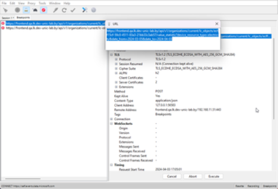
  
Рисунок 32

- Для перехода к настройкам, выбрать пункт меню Proxy => Breakpoint Settings… Рисунок 18

  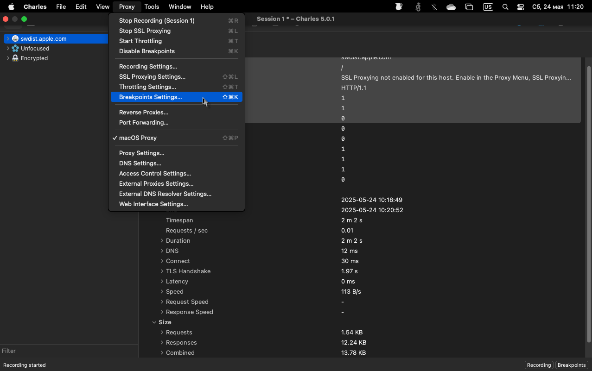
  
Рисунок 33

- Для включения установить чек-бокс ☑“Enable Breakpoints”

  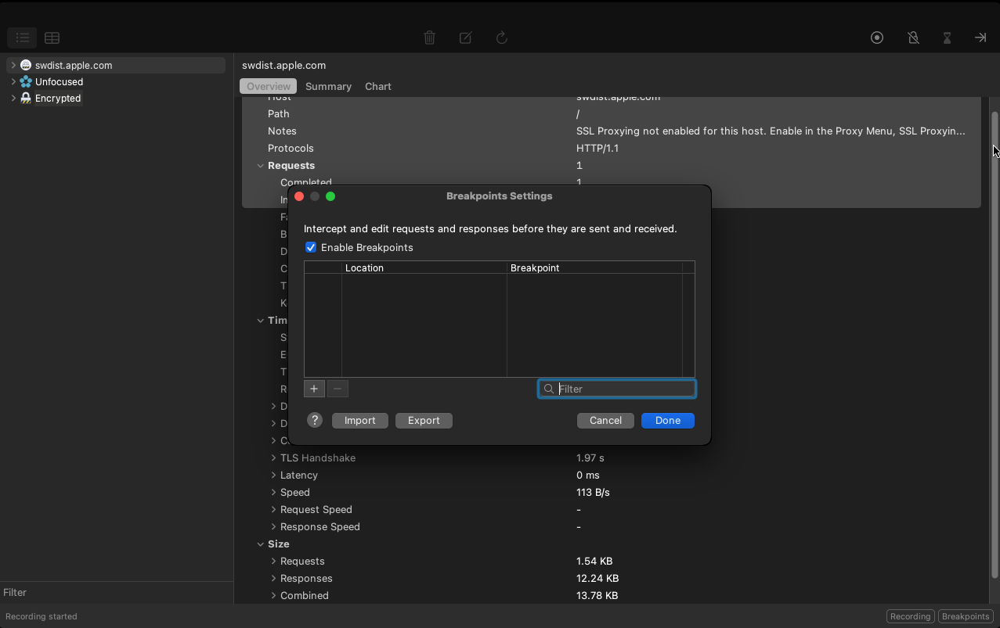
  
Рисунок 34

- В окне “Breakpoints Settings” Нажать на кнопку “Add” для добавления новых правил. В окне “Edit Breakpoint” вставить скопированный URL в ячейку Host

  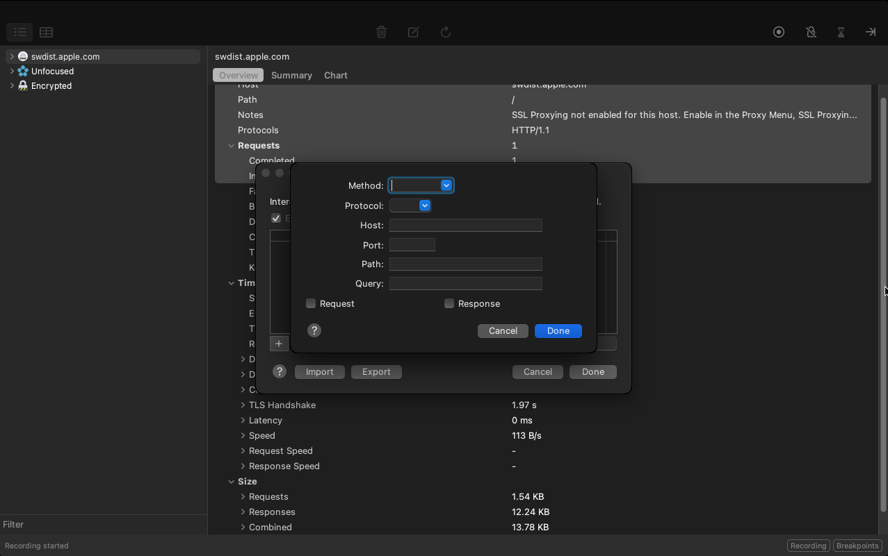
  
Рисунок 35

- После вставки URL нажать на кнопку TAB для автоматического заполнения полей

  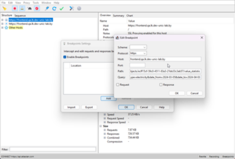
  
Рисунок 36

- Поле Query очистить и установить чек-бокс “Response” нажать ”ОК”

> **ℹ️ Информация**
>
> Устанавливать можно одновременно оба чек-бокса “Response” и ”Request”. Обработан будет только один вид, если изменить запрос, ответ не будет доступен для просмотра, если запрос не изменять, ответ будет доступен для просмотра и редактирован

  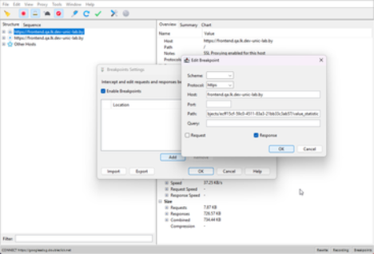
  
Рисунок 37

- Новое правило добавлено, для сохранения выбранных параметров в окне “Breakpoints Settings” нажать на кнопку “ОК”

> **ℹ️ Информация**
>
> В “Breakpoints Settings” можно добавлять разные правила для разных страниц. Каждое правило можно отключить не зависимо от других

  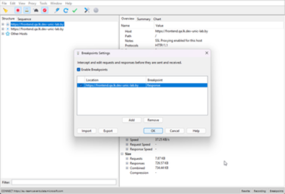
  
Рисунок 38

> **⚠️ Внимание**
>
> Обратите внимание, в левом нижнем углу есть кнопки Import и Export. Они позволяют обмениваться настройками - переносить их с одного рабочего места на другое.

- Пример редактирования ответа

  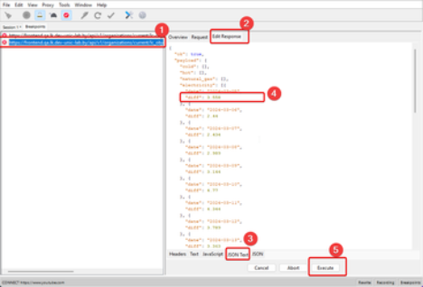
  
Рисунок 39

Пример редактирования запроса на вкладке **Breakpoints**

1. Выбрать нужный запрос
2. перейти на вкладку “Edit Response”
3. Выбрать вид отображения “JSON Text”
4. Отредактировать запрос (изменить 3,558 на 25,25)
5. Нажать “Execute”

Пример ответа после редактирования

  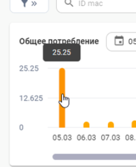
  
Рисунок 40

> **ℹ️ Информация**
>
> В принципе, изменить можно все - от header до токена авторизации. Когда редактирование будет закончено, можно выбрать Execute и в Charles Proxy появится повторный запрос, который и отправится на сервер, а потом вернется с ответом. В этот момент можно будет посмотреть и отредактировать ответ, который получит приложение - появится поле Edit response.

#### **Throttle Settings**

**Throttle Settings** — функция, позволяющая задавать разные параметры скорости соединения с выбранным доменом.

Перейдем в **Proxy** → **Throttle Settings** → галочка **Enable Throttling**. Если не разбираетесь во всех перечисленных пунктах, то можете использовать Throttle preset и там выбрать подходящую для теста скорость, а система автоматически заполнит остальные поля.

  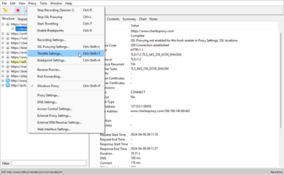
  
Рисунок 41

  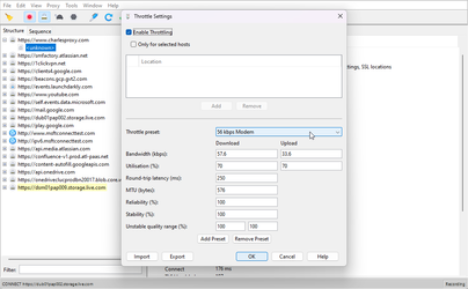
  
Рисунок 42

#### **Reverse Proxies**

**Reverse proxy** — обратный прокси-сервер. Обычно используется для того, чтобы принимать запросы из Интернета и перенаправлять их на один из веб-серверов.

#### **Port Forwarding**

**Port Forwarding** — проброс портов, который иногда называют перенаправлением портов, или туннелированием — процесс пересылки трафика, адресованного конкретному сетевому порту, с одного сетевого узла на другой. Этот метод позволяет внешнему пользователю достичь порта внутри локальной сети.

#### **Windows Proxy**

**Windows Proxy** — проксирование трафика с вашего веб-браузера.

### **Tools**

#### **Map Local**

В Map Local замена осуществляется на содержимое локального файла. В настройках вместо второго сервера мы указываем локальный путь к файлу с ответом.

- Для настройки Map Local перейти Tools => Map local…

  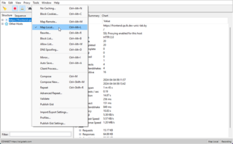
  
Рисунок 43

- Для включения Map Location, в окне Map Local Settings установить чек-бокс ☑ **Enable Map Local**

  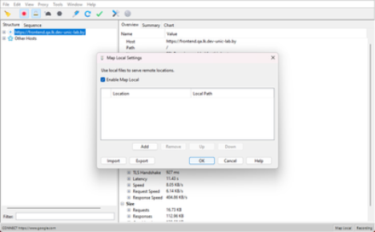
  
Рисунок 44

> **⚠️ Внимание**
>
> Обратите внимание, в левом нижнем углу есть кнопки Import и Export. Они позволяют обмениваться настройками - переносить их с одного рабочего места на другое.

- Для добавления нового правила нажать на кнопку Add, откроется новое окно Edit Mapping.
  - Вставить в поле Host скопированный URL
  - Нажать TAB для заполнения необходимых полей
  - Очистить поле Query
  - В поле Local path указать путь к файлу с ответом, для выбора файла нажать Choose и выбрать расположение файла.
  - Нажать кнопку “ОК” для сохранения параметров

  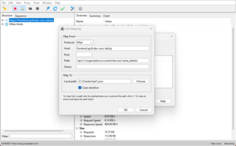
  
Рисунок 45

#### **Rewrite**

**Rewrite** — это инструмент, позволяющий создавать правила, которые изменяют запросы и ответы, когда те проходят через Charles Proxy. Например, можно добавлять и изменять заголовок, искать и заменять текст в теле ответа или запроса, и т.д.

Для включения и создания правил открыть **Tools** → **Rewrite** → галочка «**Enable Rewrite**» → **Add**. В поле **Name** можно ввести любое название подмены, либо оставить по умолчанию «Untitled Set».

  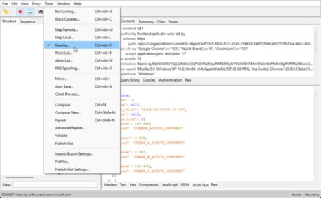
  
Рисунок 46

Следующим шагом необходимо добавить в «Location» путь запроса. Для этого, в разделе **Location** → **Add** заполните следующие поля и сохраните:\
**Host:** \
**Path:**

  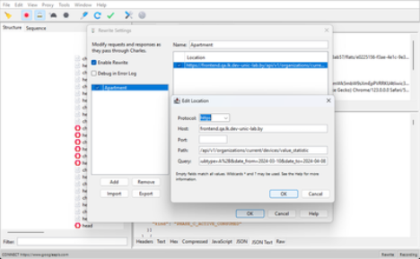
  
Рисунок 47

После того, как добавили путь запроса, необходимо изменить сам параметр и его значение. Для этого нужно создать **Rewrite Rule**:

**Type:** Body (потому что параметр находится в теле);

**Where:** Response (потому что параметр находится в ответе от сервера);

**Раздел Match:** в «Value» укажите значение и параметр, который возвращает сервер;

**Раздел Replace:** в «Value» укажите значение и параметр, который вы хотите увидеть на клиенте.

Пример: Рисунок 34, Рисунок 35

> **ℹ️ Информация**
>
> Если поле Value в разделе Match оставить пустым, то весь ответ будет заменен на значение поля Value в разделе Replace

  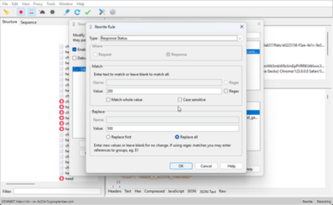
  
Рисунок 48

  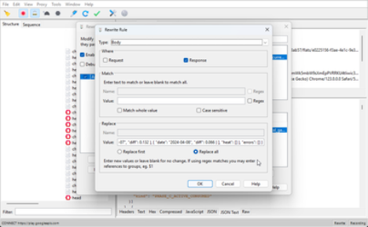
  
Рисунок 49

#### **Map Remote**

**Map Remote** — позволяет переадресовать запросы с одного URL «Map From» на другой «Map To». Подменяет хост, путь целиком или только параметры в зависимости от вашей задачи. В примере ниже подменён запрос с prod-сервера на dev-сервер.

  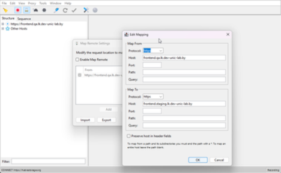
  
Рисунок 50

#### **Block List**

**Block List** — позволяет блокировать определённые доменные имена. Когда веб-браузер попытается запросить любую страницу из заблокированного доменного имени, она заблокируется. Можно выбрать либо «Drop connection», либо возврат 403 ошибки.

#### **No Caching**

Инструмент **No Caching** предотвращает кэширование, манипулируя заголовками HTTP, которые управляют кэшированием ответов. Заголовки If-Modified-Since и If-None-Match удаляются из запросов, добавляются Pragma: no-cache и Cache-control: no-cache. Заголовки Expires, Last-Modified и ETag удаляются из ответов и добавляются Expires: 0 и Cache-Control: no-cache.

  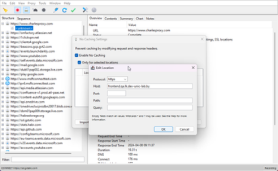
  
Рисунок 51

#### **Block Cookies**

**Block Cookies** — заголовок файла Cookie удаляется из запросов, предотвращая отправку значений файла из клиентского приложения (например веб-браузер) на удаленный сервер. А также из ответов удаляется заголовок Set-Cookie, предотвращая получение клиентским приложением запросов на установку файлов cookie с удаленного сервера. В настройках можно включить удаление Cookie как для всех хостов, так и для выбранных. В примере ниже включено удаление Cookie для всех запросов.

  
  
Рисунок 52

#### **DNS Spoofing**

Виртуальный хостинг — это когда у вас есть несколько сайтов на одном IP-адресе, и веб-сервер определяет, какой сайт вы запрашиваете, основываясь на имени, введённом в браузере. Точнее, сервер смотрит на заголовок хоста, отправленный в запросе. Например, когда нужно подменить хосты, чтобы при вводе какого-либо адреса в браузере (скажем, <http://api.youla.ru> ) запросы уходили по другому адресу (допустим, на тестовую площадку).

#### **Mirror**

**Mirror** — эта функция позволяет автоматически сохранять все ответы, возвращаемые в Charles Proxy. Они раскладываются локально в такой же иерархии, как на сервере. Если внезапно случился даунтайм на бэкенде, отвалилась тестовая среда и т. д., у вас уже есть готовые моки для Map Local. Активировать функцию можно так: **Tools** → **Mirror** или **Tools** → **Auto Save**.

#### **Compose**

**Compose** — функция редактирования запросов, которые вы поймали.

Например вы добавляете в избранное какой-то товар, но почему-то он не добавляется. Вы можете отредактировать уже отправленный запрос и отправить его еще раз. Для этого необходимо выбрать нужный запрос из списка, нажать на нём правой кнопкой и выбрать **Compose**. Иконка у запроса поменяется, и теперь можно смело его редактировать.

После того, как вы изменили нужные значения в запросе, нажмите внизу «Execute», чтобы отправить запрос на сервер.

### **Settings**

#### **Recording Settings**

**Recording Settings** — настройки отображения списков разрешенных и запрещенных доменов.

Во вкладке «Options» можно настроить лимит, то есть количество запросов, которое Charles Proxy может записать.

  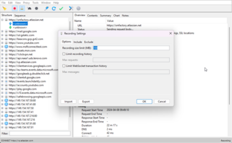
  
Рисунок 53

Во вкладке «Include» можно выбрать конкретный домен для отображения пакетов.

  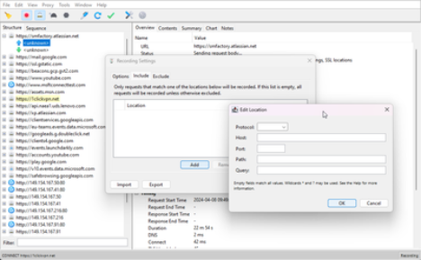
  
Рисунок 54

Во вкладке «Exclude» можем выбрать те домены, которые необходимо спрятать при сниффинге.

  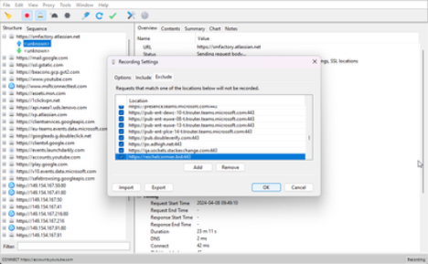
  
Рисунок 55

## **Резюме**

Конечно, список функций Charles Proxy этим не ограничивается. Есть еще много полезного - от перенаправления доменного имени на другой IP-адрес, до автоматического сохранения полученных ответов.

Отмечу, что Charles Proxy платный. Можно использовать триальную версию. Но раз в 5-7 минут поверх него будет отображаться всплывающее окно с версией, а раз в 30 минут он будет выключаться, при этом сессии не сохраняются. Решайте сами, помешает ли это вашей работе.

В целом Charles Proxy - это хороший инструмент.
