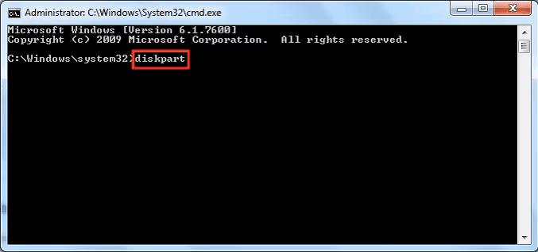
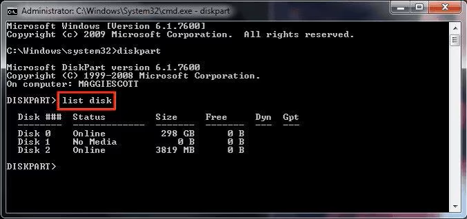
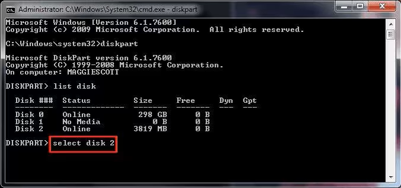
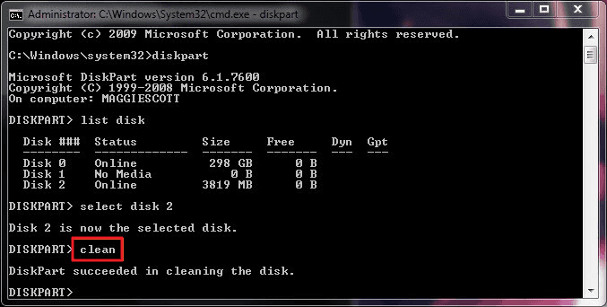
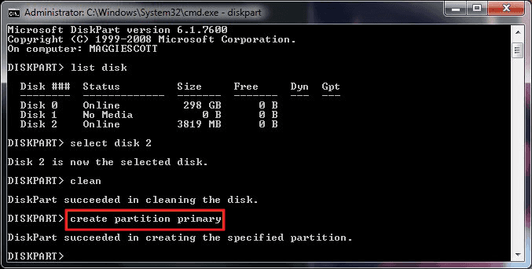
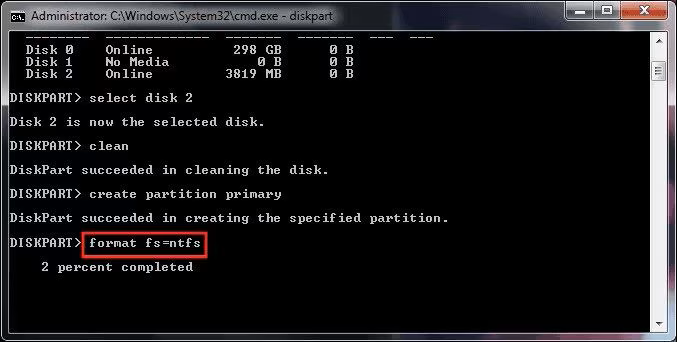
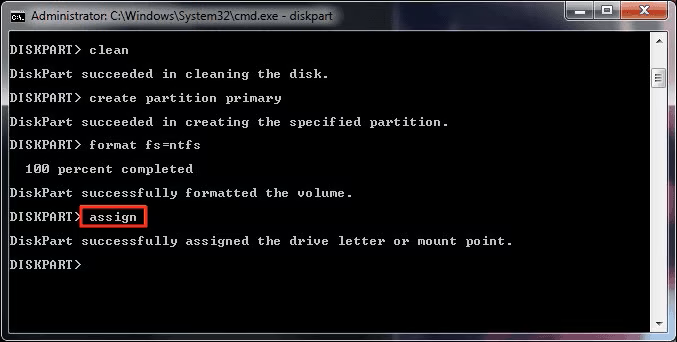

### [ ◀️ Технические гайды и инструкции](../README.md)

### **Оглавление**

- [**Установка защиты на запись**](#установка-защиты-на-запись)
- [**Работа с флешкой**](#работа-с-флешкой)
  - [**Как Отформатировать USB с Помощью CMD**](#как-отформатировать-usb-с-помощью-cmd)
- [**Работа с диском при установке ОС**](#работа-с-диском-при-установке-ос)
- [**Если нужно преобразовать диск в GPT**](#если-нужно-преобразовать-диск-в-gpt)
- [**H E L P**](#h-e-l-p)

 <!-- разделитель -->

---

## **Установка защиты на запись**

[Текущее состояние только для чтения : Нет Только для чтения: Нет] - два параметра меняются одной командой

- получить список дисков

```powershell
list disk
```

- выбрать нужный диск (2 - номер выбранного диска)

```powershell
select disk 2
```

- информация о диске

```powershell
detail disk
```

- Установить запрет на запись

```powershell
attributes disk set readonly
```

- Установка разрешение на запись (ATTR DIS CLEAR READONLY - аналог)

```powershell
attributes disk clear readonly
```

## **Работа с флешкой**

- получить список дисков

```powershell
list disk
```

- выбрать нужный диск (2 - номер выбранного диска)

```powershell
select disk 2
```

- информация о диске

```powershell
detail disk
```

- выбрать номер тома на диске

```powershell
select volume 4
```

- отформатировать в формате NTFS

```powershell
format fs=ntfs quick
```

- отформатировать в формате fat32

```powershell
format fs=fat32 quick
```

### **Как Отформатировать USB с Помощью CMD**

- Откройте командную строку Windows, введите "diskpart" и нажмите Enter.
<div align="center">
  
  <p >Рисунок 1</p>
</div>
- Появится окно, в котором вас спросят, хотите ли вы разрешить программе Diskpart запускать ваш компьютер. Нажмите кнопку "Да", чтобы продолжить.
- Появится новое окно. Затем введите"List disk." Очень важно знать, на каком диске находится USB-ключ, который вы форматируете. Эта команда выводит список всех носителей, подключенных к вашему ПК.
<div align="center">
  
  <p >Рисунок 2</p>
</div>
- Введите "Select disk Y," где Y - это диск, который вы хотите отформатировать. В этом случае Y равно 2. Если ваш выбор успешен, вы увидите "Диск Y теперь выбран как выбранный диск".
<div align="center">
  
  <p >Рисунок 3</p>
</div>
- Введите "Clean", чтобы отформатировать флешку с помощью cmd. Если форматирование прошло успешно, cmd сообщит вам, что Diskpart успешно очистил диск.
<div align="center">
  
  <p >Рисунок 4</p>
</div>
- Затем введите "create partition primary", чтобы создать указанный раздел.
<div align="center">
  
  <p >Рисунок 5</p>
</div>
- Введите (format fs=NTFS). Если вам нравится другой формат файловой системы, измените команду NTFS на желаемую, например exFAT, FAT32 и т. д. **Процесс может занять некоторое время.**
<div align="center">
  
  <p >Рисунок 6</p>
</div>
- Введите "assign" и дайте флешке букву диска.
<div align="center">
  
  <p >Рисунок 7</p>
</div>

## **Работа с диском при установке ОС**

Запускаешь установочный диск с "Windows" Когда появится экран с преложением "Установить"
внизу выбираешь пукт "Восстановление"...
Не выбирай автоматическое исправление проблем, т.к. нужен второй вариант.
Запустится окно со всевозможными инструментами, среди них выбираешь командную строку.

В появившемся окне командной строки набрать `diskpart` и нажать **ENTER**.
**Внимание!** После этого строка перед мерцающим курсором будет начинаться с DISKPART>

`list disk` - получить список дисков (эта же команда покажет какой диск защищён GPT напротив него будет стоять знак \*)
`select disk #` - выбрать нужный диск (`#` - номер выбранного диска) [Выбран диск #] - ответ от DISKPART
clean и нажать **ENTER**. (**ВНИМАНИЕ!** удаление разделов!) [DiskPart: очистка диска выполнена успешно.] - ответ от DISKPART
`create partition primary` и нажать **ENTER**. [DiskPart: Указанный раздел успешно создан.] - ответ от DISKPART
exit, **ENTER**, exit, **ENTER**. - Выход из DISKPART и CMD

## **Если нужно преобразовать диск в GPT**

- выбрать нужный диск (`#` - номер выбранного диска) [Выбран диск #] - ответ от DISKPART

```powershell
select disk #
```

- `clean` и нажать **ENTER**. (ВНИМАНИЕ! удаление разделов!) [DiskPart: очистка диска выполнена успешно.] - ответ от DISKPART

```powershell
clean
```

- `convert gpt` - переформатирует диск в GPT (если нужно форматировать в MBR, то пишем команду - `convert mbr`).

```powershell
convert gpt
```

- `exit`, **ENTER**, `exit`, **ENTER**. - Выход из DISKPART и CMD

```powershell
exit
```

## **H E L P**

`assign` - Раздел помечен как активный
