### [ ◀️ Технические гайды и инструкции](../index.md)

<a name="_hlk161744003"></a>**Руководство. По установки и использованию <a name="_hlk161743894"></a>Docker, Docker-compose**

Docker — это платформа для создания, развертывания и управления приложениями в контейнерах. Контейнеры Docker представляют собой легковесные, автономные и переносимые окружения, которые работают практически в любой среде. В этом руководстве рассмотрено, как установить Docker, основные команды docker и docker-compose, создание образа Docker, отправка его на Docker Hub, запаковка в Docker контейнер и перенос его на другой сервер без потери данных.

# **Установка и запуск Docker на Windows 11**

ℹ️ Примечание

`	`Запускаем установочный файл, загруженный с официального сайта https://www.docker.com/

**Первый запуск Docker**

1. Установку Docker выполняем по умолчанию. Установщик загружает недостающие компоненты

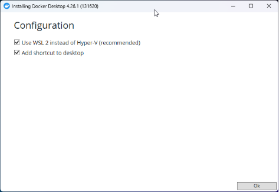

1. После окончания установки докера открыть терминал сочетанием клавиш **Windows ⊞ + R** ввести и выполнить одну из команд “_PowerShell_” или “_CMD_”
1. Обновить пакеты WSL до последней версии

**PowerShell**

```powershell
wsl --update
```

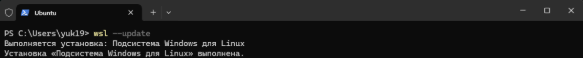

1. Установить Ubuntu

**PowerShell**

```powershell
wsl –install -d Ubuntu
```

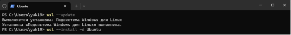

ℹ️ Примечание

`	`Пароль UNIX подобных ОС не отображается

1. Ввести имя пользователя, пароль и подтверждение пароля

**PowerShell**

Enter new UNIX username: **< username >**

New password: **< password >**

Retype new password: **< password >**

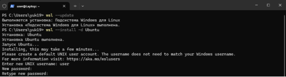

1. Установка Ubuntu завершена. После окончания установки закрыть окно.

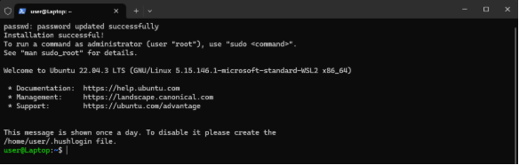

Accept
**Первый запуск Docker**

1. Нажать на кнопку .

Finish


1. Выбрать рекомендованные и нажать .

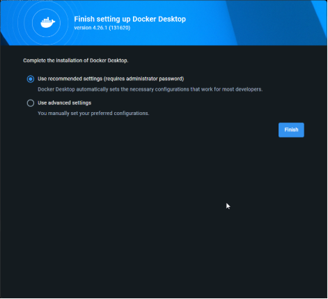

Continue

1. Указать свою роль и для чего будет использован Docker. Нажать для окончания установки

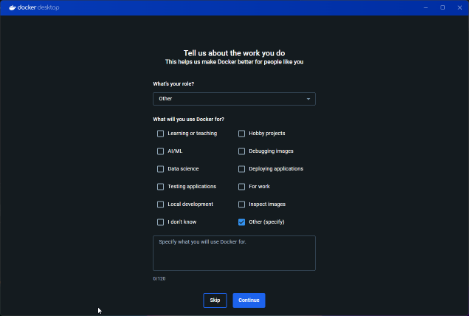

4. Проверка установленных версий docker и docker-compose

**PowerShell**

docker --version

**PowerShell**

docker-compose version

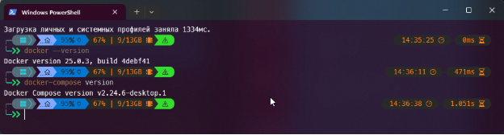

ℹ️ Примечание

`	`Установка докер производилась на чистую ос

# **Установка Docker на Ubuntu 23.10**

- Перейти на официальный сайт <https://www.docker.com/>,
- выбрать установку докера на Linux и следовать указанным шагам в зависимости от версии

1. Установка Docker с помощью репозитория apt.

_Прежде чем впервые установить Docker Engine на новый хост-компьютер, вам необходимо настроить репозиторий Docker. После этого можно установить и обновить Docker из репозитория._

**Terminal**

\# Add Docker’s official GPG key:

sudo apt-get update

sudo apt-get install ca-certificates curl

sudo install -m 0755 -d /etc/apt/keyrings

sudo curl -fsSL https://download.docker.com/linux/ubuntu/gpg -o /etc/apt/keyrings/docker.asc

sudo chmod a+r /etc/apt/keyrings/docker.asc

\# Add the repository to Apt sources:

echo \

`  `"deb [arch=$(dpkg --print-architecture) signed-by=/etc/apt/keyrings/docker.asc] https://download.docker.com/linux/ubuntu \

`  `$(. /etc/os-release && echo "$VERSION_CODENAME") stable" | \

`  `sudo tee /etc/apt/sources.list.d/docker.list > /dev/null

sudo apt-get update

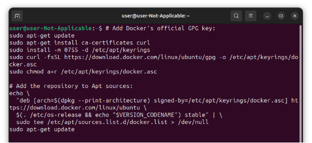

1. Установка Docker Engine, Docker compose

**Terminal**

sudo apt-get install docker-ce docker-ce-cli containerd.io docker-buildx-plugin docker-compose-plugin

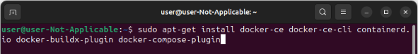

1. Проверка версии установленного по

**Terminal**

docker --version

**Terminal**

docker compose version

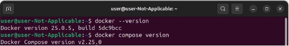

1. Проверка работы Docker, запуск тестового проекта

**Terminal**

sudo docker run hello-world

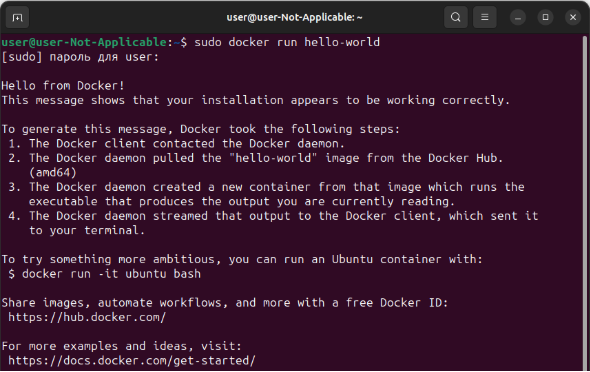

ℹ️ Примечание

`	`Обратите внимание, что текущем режиме Compose используется синтаксис compose, для использования синтаксиса -compose нужно изменить режим на Compose standalone.

5. 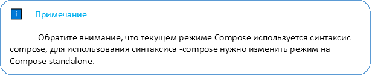Изменение режима на Compose standalone

**Terminal**

sudo curl -SL https://github.com/docker/compose/releases/download/v2.24.7/docker-compose-linux-x86\_64 -o /usr/local/bin/docker-compose

sudo chmod +x /usr/local/bin/docker-compose

sudo ln -s /usr/local/bin/docker-compose /usr/bin/docker-compose

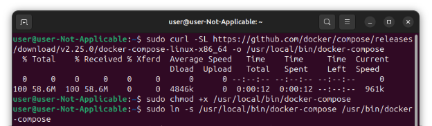

6. Проверить изменения режима Compose

**Terminal**

docker-compose --version

# **Список команд для работы с Docker**

Использование Docker контейнеров минимизирует затраты на развертывание проектов, поэтому хорошее знание команд Docker даст необходимый старт для того что бы на базовом уровне понимать Docker и как им управлять.

В этом разделе описано как создавать, запускать, останавливать, перезапускать, читать логи и тд.

1. **Управление**

- Создание из образа с последующим запуском. _--rm –_ параметр удаляет контейнер после его остановки. { id } – идентификатор образа

**Terminal**

$ docker run --rm { id }

- Создание из образа с последующим запуском. -p – параметр связывает локальный порт хостовой машины с портом приложения в контейнере первым параметром указывается порт хостовой машины, вторым порт в контейнере { id } – идентификатор образа

**Terminal**

$ docker run --rm { id }

- Старт остановленного ранее

**Terminal**

$ docker start

- Завершить работу конкретного контейнера

**Terminal**

$ docker stop { id }

- Перезапуск

**Terminal**

$ docker restart

- Удаление

**Terminal**

$ docker rm

- ` `Выводит список запущенных контейнеров

**Terminal**

$ docker ps

- Выводит список всех контейнеров в системе

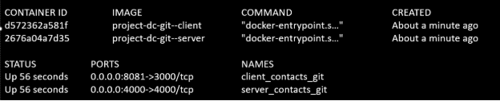

**Terminal**

$ docker ps -a

- Вывод журнала

**Terminal**

$ docker logs

- Создание нового контейнера без его запуска. Команда создает новый контейнер на основе образа, указанного в команде, и присваивает ему уникальный идентификатор

**Terminal**

$ docker create

- Вывод списка уже запущенных

**Terminal**

$ docker ls

- Отображение детальных сведений

**Terminal**

$ docker inspect

- Остановка

**Terminal**

$ docker kill

1. **Работа с образами**

- Скачивание из хранилища

**Terminal**

$ docker pull

- Создаёт из Dockerfile образ docker Image

**Terminal**

$ docker build .

- Создаёт из Dockerfile образ docker Image. -t { name }:{ tag } – параметр добавляет созданному образу имя и тег

**Terminal**

$ docker build -t { name }:{ tag } .

- Отправка в репозиторий

**Terminal**

$ docker build -t node_test-server:test-1-tag

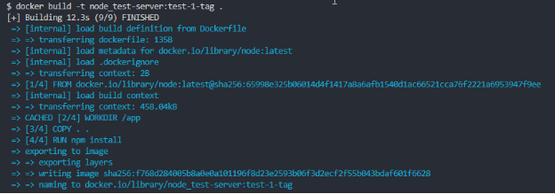

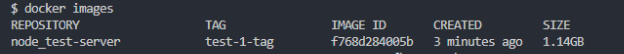

- Отправка в репозиторий

**Terminal**

$ docker push

- Удаление из локального хранилища

**Terminal**

$ docker rmi

- Отображение истории создания

**Terminal**

$ docker history

- Вывод сведений о локальных образах

**Terminal**

$ docker images

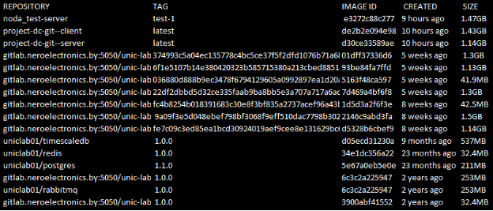

1. **Управление сетями**

- Новая сеть

```bash
$ docker network create
```

- Вывод сведений о сетях

```bash
$ docker network ls
```

- Подключение к сети

```bash
$ docker network connect
```

- Отключение от сетей

```bash
$ docker network disconnect
```

1. **Работа с томами**

- Создание нового

```bash
$ docker volume create
```

- Вывод списка

```bash
$ docker volume ls
```

- Удаление

```bash
$ docker volume rm
```

- Удаление созданных или загруженных образов по их идентификатору. Перед удалением образа нужно убедиться, что нет созданных и запущенных контейнеров на их основе.

**Terminal**

$ docker image rm { id }

- Вывод информации

**Terminal**

$ docker volume inspect

1. **Управление ресурсами**

- Вывод сведений об использовании ресурсов контейнерами

**Terminal**

$ docker stats

- Приостановка работы

**Terminal**

$ docker pause

- Возобновление работы

**Terminal**

$ docker unpause

- Обновление ресурсов

**Terminal**

$ docker update

1. **Мониторинг и отладка**

- Выполнение команды внутри запущенного контейнера

**Terminal**

$ docker exec

- Отображение информации об образах, контейнерах и сетях

**Terminal**

$ docker inspect

- Отображение процессов внутри контейнера

**Terminal**

$ docker top

- Подключение непосредственно к запущенному контейнеру

**Terminal**

$ docker attach

- Поддержка Docker Swarm\
  Запуск процедуры инициализации Docker Swarm в текущем узле

**Terminal**

$ docker swarm init

- Присоединение узла к Swarm

**Terminal**

$ docker swarm join

- Создание службы

**Terminal**

$ docker service create

- Список работающих служб

**Terminal**

$ docker service ls

# **Список команд для работы с Docker-compose**

Docker-compose является мощным инструментом для создания и управления Docker-контейнерами. Этот инструмент позволяет создавать, запускать и управлять множеством контейнеров, взаимодействуя друг с другом. В этой статье мы рассмотрим несколько команд, которые могут быть полезны при работе с Docker-compose.

1. **Команды для управления контейнерами:**

- Запуск всех контейнеров, определенных в файле docker-compose.yml.

`       `Например, команда "docker-compose up" запустит все контейнеры из файла docker-compose.yml в текущей директории.

**Terminal**

$ docker-compose up

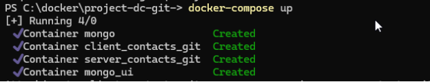

- Остановка и удаление всех контейнеров, определенных в файле docker-compose.yml.

`       `Например, команда "docker-compose down" остановит и удалит все контейнеры, которые были запущены с помощью файла docker-compose.yml.

**Terminal**

$ docker-compose down

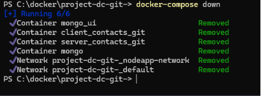

1. ` `**Команды для управления службами:**

- Отображение списка запущенных контейнеров и их статусов.

`       `Например, команда "docker-compose ps" покажет все запущенные контейнеры из файла docker-compose.yml.

**Terminal**

$ docker-compose ps

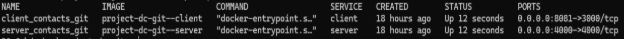

- Запуск конкретной службы из файла docker-compose.yml.

`        `Например, команда "docker-compose up nextcloud" запустит только контейнер nextcloud из файла docker-compose.yml который был остановлен.

**Terminal**

$ docker-compose up -d [SERVICE]

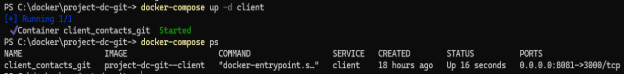

3. **Команды для управления образами:**

- Загрузка всех образов, определенных в файле docker-compose.yml. Например, команда "docker-compose pull" загрузит все образы, указанные в файле docker-compose.yml.

**Terminal**

$ docker-compose pull

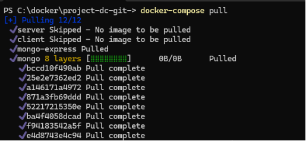

- Сборка образов, определенных в файле docker-compose.yml. Например, команда "docker-compose build" соберет все образы, указанные в файле docker-compose.yml.

**Terminal**

$ docker-compose build

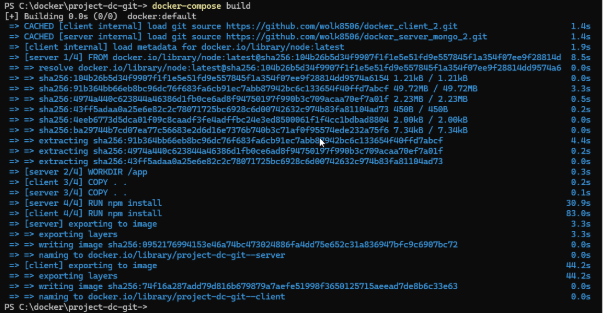

4. **Команды для управления логами:**

- Просмотр логов всех контейнеров, определенных в файле docker-compose.yml. Например, команда "docker-compose logs" выведет логи всех контейнеров из файла docker-compose.yml.

**Terminal**

$ docker-compose logs

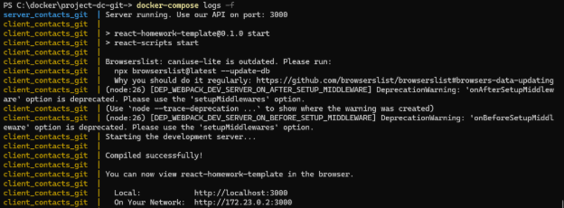

- Просмотр логов конкретной службы из файла docker-compose.yml. Например, команда "docker-compose logs nextcloud_db" выведет логи только контейнера базы данных из файла docker-compose.yml.

**Terminal**

$ docker-compose logs [SERVICE]

5. **Команды для управления контейнерами в работе:**

- Остановка всех контейнеров, определенных в файле docker-compose.yml, но без их удаления. Например, команда "docker-compose stop" остановит все контейнеры из файла docker-compose.yml.

**Terminal**

$ docker-compose stop

- Запуск всех остановленных контейнеров, определенных в файле docker-compose.yml. Например, команда "docker-compose start" запустит все остановленные контейнеры из файла docker-compose.yml.

**Terminal**

$ docker-compose start

- Заставляет Docker Compose пересоздать контейнеры, даже если их конфигурация или образ не изменился. Это означает, что Compose остановит и удалит существующие контейнеры для указанных в файле docker-compose.yml сервисов, а затем создаст новые контейнеры с нуля, используя последнюю версию образов, определенных в файле. Использование опции **--force-recreate** полезно в ситуациях, когда вы внесли изменения в файл **docker-compose.yml**, которые затрагивают конфигурацию контейнера, например, переменные среды или отображение портов.

**Terminal**

$ docker-compose up --force-recreate

6. **Команды для управления сетями:**

- Отображение списка сетей, определенных в файле docker-compose.yml если они есть. Так же можно воспользоваться командой **docker network ls.**

**Terminal**

$ docker-compose network ls

- Создание новой сети в файле docker-compose.yml. Например, команда "docker-compose network create frontend" создаст новую сеть с названием frontend в файле docker-compose.yml.

**Terminal**

$ docker-compose network create [NETWORK]

- Удаление сети, определенной в файле docker-compose.yml. Например, команда "docker-compose network rm frontend" удалит сеть с названием frontend из файла docker-compose.yml.

**Terminal**

$ docker-compose network rm [NETWORK]

7. **Команды для управления переменными окружения:**

- Проверка корректности файла docker-compose.yml и отображения всех переменных окружения, определенных в нем. Например, команда "docker-compose config" проверит корректность файла docker-compose.yml и покажет все переменные окружения, определенные в нем.

**Terminal**

$ docker-compose config

- Выполнение команды внутри контейнера, определенного в файле docker-compose.yml. Например, команда "docker-compose exec nextcloud ls" выполнит команду "ls" внутри контейнера nextcloud, который определен в файле docker-compose.yml.

**Terminal**

$ docker-compose exec [SERVICE] [COMMAND]

8. **Команды для управления объемами:**

- Отображение списка всех объемов, определенных в файле docker-compose.yml. Например, команда "docker-compose volume ls" или "**docker volume ls**" покажет все объемы, которые определены в файле docker-compose.yml.

**Terminal**

$ docker-compose volume ls

- Создания нового объема, определенного в файле docker-compose.yml. Например, команда "docker-compose volume create db_data" создаст новый объем с названием db_data в файле docker-compose.yml.

**Terminal**

$ docker-compose volume create [VOLUME]

- Удаление объема, определенного в файле docker-compose.yml. Например, команда "docker-compose volume rm db_data" удалит объем с названием db_data из файла docker-compose.yml.

**Terminal**

$ docker-compose volume rm [VOLUME]

# **Как запаковать Docker контейнер и перенести его на другой сервер без потери данных**

1. **Остановить контейнер**

Перед запаковкой контейнера необходимо остановить его. Используйте команду **docker stop** для остановки контейнера:

**Terminal**

$ docker stop **<container_name>**

Здесь **<container_name>** — это имя контейнера, который вы хотите остановить.

1. **Сохранить контейнер в образ**

Чтобы запаковать контейнер, необходимо сохранить его в образ. Используйте команду **docker commit** для сохранения контейнера в образ:

$ docker commit **<container_name> <image_name>**

Здесь **<container_name>** - это имя остановленного контейнера, а **<image_name>** - это имя образа, в который будет сохранен контейнер.

1. **Экспортировать образ в файл**

Чтобы перенести образ на другой сервер, необходимо экспортировать его в файл. Используйте команду **docker save** для экспортирования образа в файл:

$ docker save **<image_name>** > **<file_name>**.tar

или

$ docker save **<image_name>** -o **<file_name>**.tar

Здесь **<image_name>** - это имя образа, который нужно экспортировать, а **<file_name>** - это имя файла, в который будет экспортирован образ.

1. **Перенести файл на другой сервер**

Скопируйте файл **<file_name>.tar** на другой сервер. Для этого можете использовать команду **scp**:

$ scp **<file_name>**.tar **<user>**@**<server_ip>**:**<path>**

Здесь **<user>** - это имя пользователя на удаленном сервере, **<server_ip>** - это IP-адрес удаленного сервера, а **<path>** - это путь к месту, где нужно сохранить файл на удаленном сервере.

1. **Импортировать образ на другом сервере**

Чтобы использовать образ на другом сервере, необходимо импортировать его из файла. Используйте команду **docker load** для импортирования образа из файла:

$ docker load < **<file_name>**.tar

1. **Запустить контейнер**

После импорта образа можно запустить контейнер на другом сервере. Используйте команду docker run для запуска контейнера:

$ docker run -d --name **<container_name>** **<image_name>**

Здесь **<container_name>** - это имя контейнера, который вы хотите запустить, а **<image_name>** - это имя образа, который вы хотите использовать для запуска контейнера.

# **Создание образа Docker и отправка его на <a name="_hlk161861056"></a>Docker Hub**

1. **Авторизация**

Ввести команду для начала инициализации авторизации

$ docker login

При необходимости входа на репозиторий не Docker Hub

$ docker login -u **<login>** -p **<password> <адресс репозитория>**

1. **Ввод логина если не авторизован**

При первом подключении ввести логин с Docker Hub. При повторном подключении логин не запрашивает.

$ login: **<login docker hub>**

1. **Создание образа**

- **<username>** указываем логин с Docker Hub.
- **<image>** - имя создаваемого образа.
- **<tag>** - указывается тег, тег можно не указывать. Обычно указывается версия образа
- **.** - Точка говорит о том, что копируем всю текущую директорию, или вместо точки указываем путь к файлам.

$ docker build -t **<username>**/**<image>**:**<tag>** .

1. **Отправка образа на Docker Hub**

$ docker push **<username>**/**<image>:<tag>**

1. **Загрузка образа с Docker Hub**

- myapp – указывается желаемое имя загружаемого образа
- **<username> -** указываем логин с Docker Hub где лежит образ
- **<image> -** имя образа на Docker Hub.
- **<tag> -** если не указать, то загружается последняя версия.

$ docker run -p 3000:3000 –-name myapp **<username>**/**<image>:<tag>**
