### [ ◀️ Технические гайды и инструкции](../README.md)

# **Руководство. По установки и использованию Docker, Docker-compose**

### **Оглавление**

- [**Руководство. По установки и использованию Docker, Docker-compose**](#руководство-по-установки-и-использованию-docker-docker-compose)
  - [**Оглавление**](#оглавление)
  - [**О Docker**](#о-docker)
  - [**Установка и запуск Docker на Windows 11**](#установка-и-запуск-docker-на-windows-11)
    - [**Установка Docker**](#установка-docker)
    - [**Первый запуск Docker**](#первый-запуск-docker)
    - [**Установка Docker на Ubuntu 23.10**](#установка-docker-на-ubuntu-2310)
  - [**Список команд для работы с Docker**](#список-команд-для-работы-с-docker)
    - [**Управление**](#управление)
    - [**Работа с образами**](#работа-с-образами)
    - [**Управление сетями**](#управление-сетями)
    - [**Мониторинг и отладка**](#мониторинг-и-отладка)
  - [**Список команд для работы с Docker-compose**](#список-команд-для-работы-с-docker-compose)
    - [**Команды для управления контейнерами**](#команды-для-управления-контейнерами)
    - [**Команды для управления службами**](#команды-для-управления-службами)
    - [**Команды для управления образами**](#команды-для-управления-образами)
    - [**Команды для управления логами**](#команды-для-управления-логами)
    - [**Команды для управления контейнерами в работе**](#команды-для-управления-контейнерами-в-работе)
    - [**Команды для управления сетями**](#команды-для-управления-сетями)
    - [**Команды для управления переменными окружения**](#команды-для-управления-переменными-окружения)
    - [**Команды для управления объемами**](#команды-для-управления-объемами)
  - [**Как запаковать Docker контейнер и перенести его на другой сервер без потери данных**](#как-запаковать-docker-контейнер-и-перенести-его-на-другой-сервер-без-потери-данных)
  - [**Создание образа Docker и отправка его на Docker Hub**](#создание-образа-docker-и-отправка-его-на-docker-hub)

<!-- разделитель -->

---

## **О Docker**

Docker — это платформа для создания, развертывания и управления приложениями в контейнерах. Контейнеры Docker представляют собой легковесные, автономные и переносимые окружения, которые работают практически в любой среде. В этом руководстве рассмотрено, как установить Docker, основные команды docker и docker-compose, создание образа Docker, отправка его на Docker Hub, запаковка в Docker контейнер и перенос его на другой сервер без потери данных.

## **Установка и запуск Docker на Windows 11**

### **Установка Docker**

> **ℹ️ Примечание**
>
> Запускаем установочный файл, загруженный с официального сайта https://www.docker.com/

1. Установку Docker выполняем по умолчанию. Установщик загружает недостающие компоненты

<div align="center">
  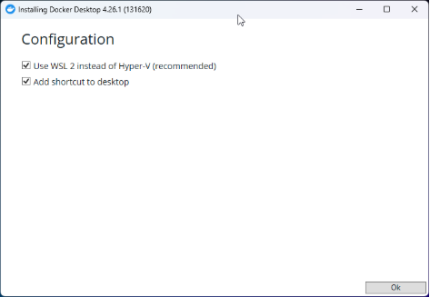
  <p>Рисунок 1</p>
</div>

2. После окончания установки докера открыть терминал сочетанием клавиш `Windows ⊞ + R` ввести и выполнить одну из команд **_PowerShell_** или **_CMD_**
3. Обновить пакеты WSL до последней версии

**PowerShell**

```powershell
wsl --update
```

<div align="center">
  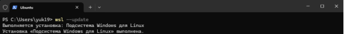
  <p>Рисунок 2</p>
</div>

4. Установить Ubuntu

**PowerShell**

```powershell
wsl –install -d Ubuntu
```

<div align="center">
  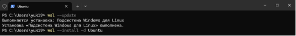
  <p>Рисунок 3</p>
</div>

> **ℹ️ Примечание**
>
> Пароль UNIX подобных ОС не отображается

Ввести имя пользователя, пароль и подтверждение пароля

**PowerShell**

Enter new UNIX username: `< username >`

New password: `< password >`

Retype new password: `< password >`

<div align="center">
  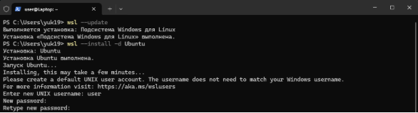
  <p>Рисунок 4</p>
</div>

1. Установка Ubuntu завершена. После окончания установки закрыть окно.

<div align="center">
  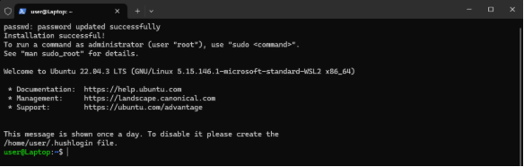
  <p>Рисунок 5</p>
</div>

### **Первый запуск Docker**

1. Нажать на кнопку 

<div align="center">
  
  <p>Рисунок 6</p>
</div>

2. Выбрать рекомендованные и нажать .

<div align="center">
  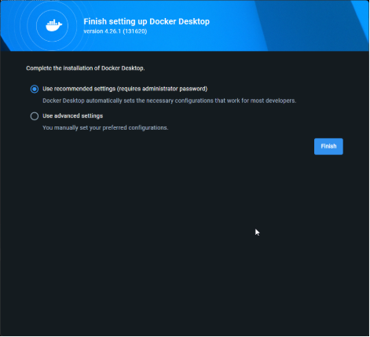
  <p>Рисунок 7</p>
</div>

3. Указать свою роль и для чего будет использован Docker. Нажать  для окончания установки

<div align="center">
  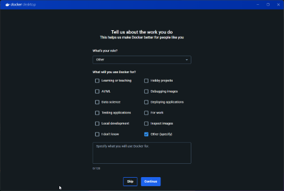
  <p>Рисунок 8</p>
</div>

4. Проверка установленных версий docker и docker-compose

**PowerShell**

```powershell
docker --version
```

**PowerShell**

```powershell
docker-compose version
```

<div align="center">
  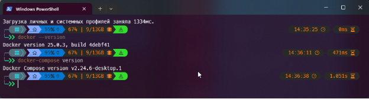
  <p>Рисунок 9</p>
</div>

> **ℹ️ Примечание**
>
> Установка докер производилась на чистую ОС

### **Установка Docker на Ubuntu 23.10**

- Перейти на официальный сайт [Docker](https://www.docker.com),
- выбрать установку докера на Linux и следовать указанным шагам в зависимости от версии

1. Установка Docker с помощью репозитория apt. _Прежде чем впервые установить Docker Engine на новый хост-компьютер, вам необходимо настроить репозиторий Docker. После этого можно установить и обновить Docker из репозитория._

**Terminal**

```bash
\# Add Docker’s official GPG key:

sudo apt-get update

sudo apt-get install ca-certificates curl

sudo install -m 0755 -d /etc/apt/keyrings

sudo curl -fsSL https://download.docker.com/linux/ubuntu/gpg -o /etc/apt/keyrings/docker.asc

sudo chmod a+r /etc/apt/keyrings/docker.asc

\# Add the repository to Apt sources:

echo \

`  `"deb [arch=$(dpkg --print-architecture) signed-by=/etc/apt/keyrings/docker.asc] https://download.docker.com/linux/ubuntu \

`  `$(. /etc/os-release && echo "$VERSION_CODENAME") stable" | \

`  `sudo tee /etc/apt/sources.list.d/docker.list > /dev/null

sudo apt-get update
```

<div align="center">
  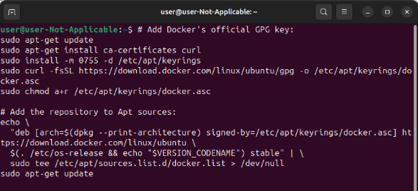
  <p>Рисунок 10</p>
</div>

2. Установка Docker Engine, Docker compose

**Terminal**

```bash
sudo apt-get install docker-ce docker-ce-cli containerd.io docker-buildx-plugin docker-compose-plugin
```

<div align="center">
  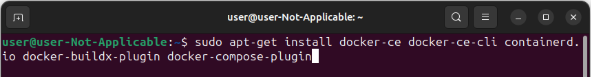
  <p>Рисунок 11</p>
</div>

3. Проверка версии установленного по

**Terminal**

```bash
docker --version
```

**Terminal**

```bash
docker compose version
```

<div align="center">
  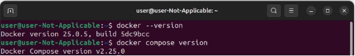
  <p>Рисунок 12</p>
</div>

4. Проверка работы Docker, запуск тестового проекта

**Terminal**

```bash
sudo docker run hello-world
```

<div align="center">
  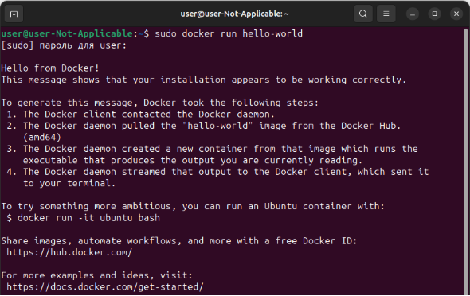
  <p>Рисунок 13</p>
</div>

> **ℹ️ Примечание**
>
> Обратите внимание, что текущем режиме Compose используется синтаксис compose, для использования синтаксиса -compose нужно изменить режим на `Compose standalone`.

**Terminal**

```bash
sudo curl -SL https://github.com/docker/compose/releases/download/v2.24.7/docker-compose-linux-x86\_64 -o /usr/local/bin/docker-compose

sudo chmod +x /usr/local/bin/docker-compose

sudo ln -s /usr/local/bin/docker-compose /usr/bin/docker-compose
```

<div align="center">
  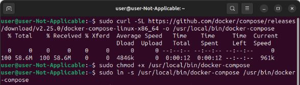
  <p>Рисунок 14</p>
</div>

5. Проверить изменения режима Compose

**Terminal**

```bash
docker-compose --version
```

<div align="center">
  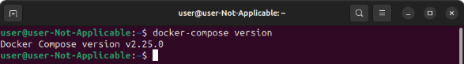
  <p>Рисунок 15</p>
</div>

## **Список команд для работы с Docker**

Использование Docker контейнеров минимизирует затраты на развертывание проектов, поэтому хорошее знание команд Docker даст необходимый старт для того что бы на базовом уровне понимать Docker и как им управлять.

В этом разделе описано как создавать, запускать, останавливать, перезапускать, читать логи и тд.

### **Управление**

- Создание из образа с последующим запуском. `--rm` - параметр удаляет контейнер после его остановки. `{ id }` – идентификатор образа

**Terminal**

```bash
$ docker run --rm { id }
```

- Создание из образа с последующим запуском. `-p` – параметр связывает локальный порт хостовой машины с портом приложения в контейнере первым параметром указывается порт хостовой машины, вторым порт в контейнере `{ id }` – идентификатор образа

**Terminal**

```bash
$ docker run --rm { id }
```

- Старт остановленного ранее

**Terminal**

```bash
$ docker start
```

- Завершить работу конкретного контейнера

**Terminal**

```bash
$ docker stop { id }
```

- Перезапуск

**Terminal**

```bash
$ docker restart
```

- Удаление

**Terminal**

```bash
$ docker rm
```

- Выводит список запущенных контейнеров

**Terminal**

```bash
$ docker ps
```

- Выводит список всех контейнеров в системе

<div align="center">
  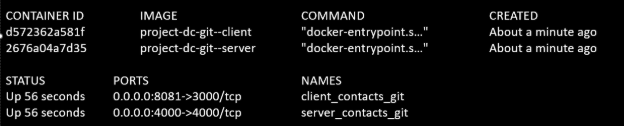
  <p>Рисунок 16</p>
</div>

**Terminal**

```bash
$ docker ps -a
```

- Вывод журнала

$**Terminal**$

```bash
$ docker logs
```

- Создание нового контейнера без его запуска. Команда создает новый контейнер на основе образа, указанного в команде, и присваивает ему уникальный идентификатор

**Terminal**

```bash
$ docker create
```

- Вывод списка уже запущенных

**Terminal**

```bash
$ docker ls
```

- Отображение детальных сведений

**Terminal**

```bash
$ docker inspect
```

- Остановка

**Terminal**

```bash
$ docker kill
```

### **Работа с образами**

- Скачивание из хранилища

**Terminal**

```bash
$ docker pull
```

- Создаёт из Dockerfile образ docker Image

**Terminal**

```bash
$ docker build .
```

- Создаёт из Dockerfile образ docker Image. `-t { name }:{ tag }` – параметр добавляет созданному образу имя и тег

**Terminal**

```bash
$ docker build -t { name }:{ tag } .
```

- Отправка в репозиторий

**Terminal**

```bash
$ docker build -t node_test-server:test-1-tag
```

<div align="center">
  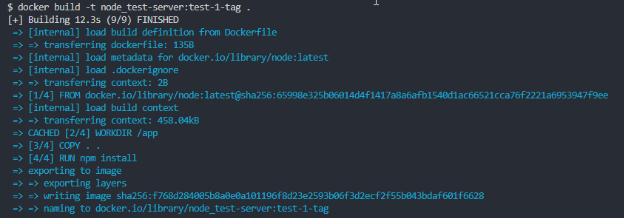
  <p>Рисунок 17</p>
</div>

<div align="center">
  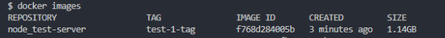
  <p>Рисунок 18</p>
</div>

- Отправка в репозиторий

**Terminal**

```bash
$ docker push
```

- Удаление из локального хранилища

**Terminal**

```bash
$ docker rmi
```

- Отображение истории создания

**Terminal**

```bash
$ docker history
```

- Вывод сведений о локальных образах

**Terminal**

```bash
$ docker images
```

<div align="center">
  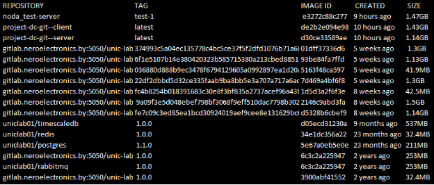
  <p>Рисунок 19</p>
</div>

### **Управление сетями**

- Новая сеть

```bash
$ docker network create
```

- Вывод сведений о сетях

```bash
$ docker network ls
```

- Подключение к сети

```bash
$ docker network connect
```

- Отключение от сетей

```bash
$ docker network disconnect
```

2. **Работа с томами**

- Создание нового

```bash
$ docker volume create
```

- Вывод списка

```bash
$ docker volume ls
```

- Удаление

```bash
$ docker volume rm
```

- Удаление созданных или загруженных образов по их идентификатору. Перед удалением образа нужно убедиться, что нет созданных и запущенных контейнеров на их основе.

**Terminal**

```bash
$ docker image rm { id }
```

- Вывод информации

**Terminal**

```bash
$ docker volume inspect
```

3. **Управление ресурсами**

- Вывод сведений об использовании ресурсов контейнерами

**Terminal**

```bash
$ docker stats
```

- Приостановка работы

**Terminal**

```bash
$ docker pause
```

- Возобновление работы

**Terminal**

```bash
$ docker unpause
```

- Обновление ресурсов

**Terminal**

```bash
$ docker update
```

### **Мониторинг и отладка**

- Выполнение команды внутри запущенного контейнера

**Terminal**

```bash
$ docker exec
```

- Отображение информации об образах, контейнерах и сетях

**Terminal**

```bash
$ docker inspect
```

- Отображение процессов внутри контейнера

**Terminal**

```bash
$ docker top
```

- Подключение непосредственно к запущенному контейнеру

**Terminal**

```bash
$ docker attach
```

- Поддержка Docker Swarm. Запуск процедуры инициализации Docker Swarm в текущем узле

**Terminal**

```bash
$ docker swarm init
```

- Присоединение узла к Swarm

**Terminal**

```bash
$ docker swarm join
```

- Создание службы

**Terminal**

```bash
$ docker service create
```

- Список работающих служб

**Terminal**

```bash
$ docker service ls
```

## **Список команд для работы с Docker-compose**

Docker-compose является мощным инструментом для создания и управления Docker-контейнерами. Этот инструмент позволяет создавать, запускать и управлять множеством контейнеров, взаимодействуя друг с другом. В этой статье мы рассмотрим несколько команд, которые могут быть полезны при работе с Docker-compose.

### **Команды для управления контейнерами**

- Запуск всех контейнеров, определенных в файле `docker-compose.yml`.

Например, команда `docker-compose up` запустит все контейнеры из файла `docker-compose.yml` в текущей директории.

**Terminal**

```bash
$ docker-compose up
```

<div align="center">
  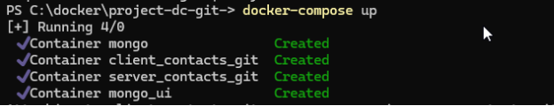
  <p>Рисунок 20</p>
</div>

- Остановка и удаление всех контейнеров, определенных в файле `docker-compose.yml` Например, команда "docker-compose down" остановит и удалит все контейнеры, которые были запущены с помощью файла `docker-compose.yml`.

**Terminal**

```bash
$ docker-compose down
```

<div align="center">
  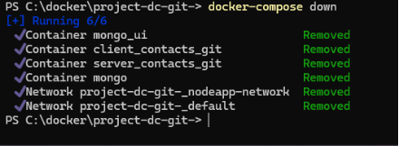
  <p>Рисунок 21</p>
</div>

### **Команды для управления службами**

- Отображение списка запущенных контейнеров и их статусов. Например, команда `docker-compose ps` покажет все запущенные контейнеры из файла `docker-compose.yml`.

**Terminal**

```bash
$ docker-compose ps
```

<div align="center">
  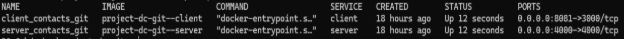
  <p>Рисунок 22</p>
</div>

- Запуск конкретной службы из файла `docker-compose.yml`. Например, команда `docker-compose up nextcloud` запустит только **контейнер** nextcloud из файла `docker-compose.yml` который был остановлен.

**Terminal**

```bash
$ docker-compose up -d [SERVICE]
```

<div align="center">
  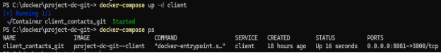
  <p>Рисунок 23</p>
</div>

### **Команды для управления образами**

- Загрузка всех образов, определенных в файле `docker-compose.yml`. Например, команда `docker-compose pull` загрузит все образы, указанные в файле `docker-compose.yml`.

**Terminal**

```bash
$ docker-compose pull
```

<div align="center">
  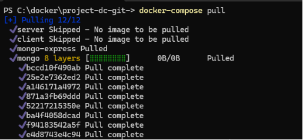
  <p>Рисунок 24</p>
</div>

- Сборка образов, определенных в файле `docker-compose.yml`. Например, команда `docker-compose build` соберет все образы, указанные в файле `docker-compose.yml`.

**Terminal**

```bash
$ docker-compose build
```

<div align="center">
  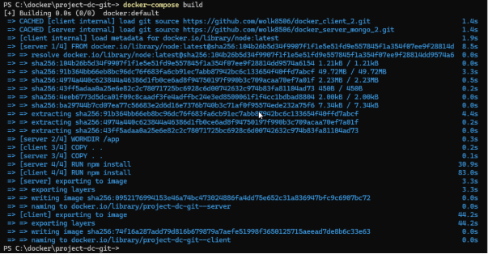
  <p>Рисунок 25</p>
</div>

### **Команды для управления логами**

- Просмотр логов всех контейнеров, определенных в файле `docker-compose.yml`. Например, команда `docker-compose logs` выведет логи всех контейнеров из файла `docker-compose.yml`.

**Terminal**

```bash
$ docker-compose logs
```

<div align="center">
  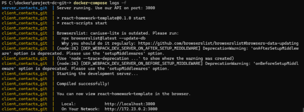
  <p>Рисунок 26</p>
</div>

- Просмотр логов конкретной службы из файла `docker-compose.yml`. Например, команда `docker-compose logs nextcloud_db` выведет логи только контейнера базы данных из файла `docker-compose.yml`.

**Terminal**

```bash
$ docker-compose logs [SERVICE]
```

### **Команды для управления контейнерами в работе**

- Остановка всех контейнеров, определенных в файле `docker-compose.yml`, но без их удаления. Например, команда `docker-compose stop` остановит все контейнеры из файла `docker-compose.yml`.

**Terminal**

```bash
$ docker-compose stop
```

- Запуск всех остановленных контейнеров, определенных в файле `docker-compose.yml`. Например, команда `docker-compose start` запустит все остановленные контейнеры из файла `docker-compose.yml`.

**Terminal**

```bash
$ docker-compose start
```

- Заставляет Docker Compose пересоздать контейнеры, даже если их конфигурация или образ не изменился. Это означает, что Compose остановит и удалит существующие контейнеры для указанных в файле docker-compose.yml сервисов, а затем создаст новые контейнеры с нуля, используя последнюю версию образов, определенных в файле. Использование опции `--force-recreate` полезно в ситуациях, когда вы внесли изменения в файл `docker-compose.yml`, которые затрагивают конфигурацию контейнера, например, переменные среды или отображение портов.

**Terminal**

```bash
$ docker-compose up --force-recreate
```

### **Команды для управления сетями**

- Отображение списка сетей, определенных в файле `docker-compose.yml` если они есть. Так же можно воспользоваться командой `docker network ls`.

**Terminal**

```bash
$ docker-compose network ls
```

- Создание новой сети в файле `docker-compose.yml`. Например, команда `docker-compose network create frontend` создаст новую сеть с названием frontend в файле `docker-compose.yml`.

**Terminal**

```bash
$ docker-compose network create [NETWORK]
```

- Удаление сети, определенной в файле `docker-compose.yml`. Например, команда `docker-compose network rm frontend` удалит сеть с названием frontend из файла `docker-compose.yml`.

**Terminal**

```bash
$ docker-compose network rm [NETWORK]
```

### **Команды для управления переменными окружения**

- Проверка корректности файла `docker-compose.yml` и отображения всех переменных окружения, определенных в нем. Например, команда `docker-compose config` проверит корректность файла `docker-compose.yml` и покажет все переменные окружения, определенные в нем.

**Terminal**

```bash
$ docker-compose config
```

- Выполнение команды внутри контейнера, определенного в файле `docker-compose.yml`. Например, команда `docker-compose exec nextcloud ls` выполнит команду `ls` внутри контейнера `nextcloud`, который определен в файле `docker-compose.yml`.

**Terminal**

```bash
$ docker-compose exec [SERVICE] [COMMAND]
```

### **Команды для управления объемами**

- Отображение списка всех объемов, определенных в файле `docker-compose.yml`. Например, команда `docker-compose volume ls` или `docker volume ls` покажет все объемы, которые определены в файле `docker-compose.yml`.

**Terminal**

```bash
$ docker-compose volume ls
```

- Создания нового объема, определенного в файле `docker-compose.yml`. Например, команда `docker-compose volume create db_data` создаст новый объем с названием `db_data` в файле `docker-compose.yml`.

**Terminal**

```bash
$ docker-compose volume create [VOLUME]
```

- Удаление объема, определенного в файле `docker-compose.yml`. Например, команда `docker-compose volume rm db_data` удалит объем с названием `db_data` из файла `docker-compose.yml`.

**Terminal**

```bash
$ docker-compose volume rm [VOLUME]
```

## **Как запаковать Docker контейнер и перенести его на другой сервер без потери данных**

- **Остановить контейнер**

Перед запаковкой контейнера необходимо остановить его. Используйте команду `docker stop` для остановки контейнера:

**Terminal**

```bash
$ docker stop {container_name}
```

Здесь `{container_name}` — это имя контейнера, который вы хотите остановить.

- **Сохранить контейнер в образ**

Чтобы запаковать контейнер, необходимо сохранить его в образ. Используйте команду `docker commit` для сохранения контейнера в образ:

```bash
$ docker commit {container_name} {image_name}
```

Здесь `{container_name}` - это имя остановленного контейнера, а `{image_name}` - это имя образа, в который будет сохранен контейнер.

- **Экспортировать образ в файл**

Чтобы перенести образ на другой сервер, необходимо экспортировать его в файл. Используйте команду `docker save` для экспортирования образа в файл:

```bash
$ docker save {image_name} > {file_name}.tar
```

или

```bash
$ docker save {image_name} -o {file_name}.tar
```

Здесь `{image_name}` - это имя образа, который нужно экспортировать, а `{file_name}` - это имя файла, в который будет экспортирован образ.

- **Перенести файл на другой сервер**

Скопируйте файл `{file_name}.tar` на другой сервер. Для этого можете использовать команду `scp`:

```bash
$ scp {file_name}.tar {user}@{server_ip}:{path}
```

Здесь `{user}` - это имя пользователя на удаленном сервере, `{server_ip}` - это IP-адрес удаленного сервера, а `{path}` - это путь к месту, где нужно сохранить файл на удаленном сервере.

- **Импортировать образ на другом сервере**

Чтобы использовать образ на другом сервере, необходимо импортировать его из файла. Используйте команду `docker load` для импортирования образа из файла:

```bash
$ docker load < {file_name}.tar
```

- **Запустить контейнер**

После импорта образа можно запустить контейнер на другом сервере. Используйте команду docker run для запуска контейнера:

```bash
$ docker run -d --name {container_name} {image_name}
```

Здесь `{container_name}` - это имя контейнера, который вы хотите запустить, а `{image_name}` - это имя образа, который вы хотите использовать для запуска контейнера.

## **Создание образа Docker и отправка его на Docker Hub**

- **Авторизация**

Ввести команду для начала инициализации авторизации

```bash
$ docker login
```

При необходимости входа на репозиторий не Docker Hub

```bash
$ docker login -u {login} -p {password} {адресс репозитория}
```

- **Ввод логина если не авторизован**

При первом подключении ввести логин с Docker Hub. При повторном подключении логин не запрашивает.

```bash
$ login: {login docker hub}
```

- **Создание образа**

- `{username}` - указываем логин с Docker Hub.
- `{image}` - имя создаваемого образа.
- `{tag}` - указывается тег, тег можно не указывать. Обычно указывается версия образа
- `.` - Точка говорит о том, что копируем всю текущую директорию, или вместо точки указываем путь к файлам.

```bash
$ docker build -t {username}/{image}:{tag} .
```

- **Отправка образа на Docker Hub**

```bash
$ docker push {username}/{image}:{tag}
```

- **Загрузка образа с Docker Hub**

- myapp – указывается желаемое имя загружаемого образа
- `{username}` - указываем логин с Docker Hub где лежит образ
- `{image}` - имя образа на Docker Hub.
- `{tag}` - если не указать, то загружается последняя версия.

```bash
$ docker run -p 3000:3000 –-name myapp {username}/{image}:{tag}
```
