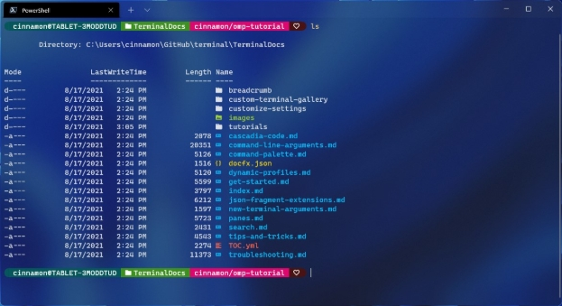
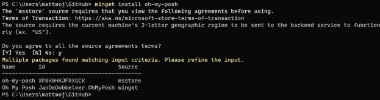

### [ ◀️ Технические гайды и инструкции](../index.md)

# **Руководство. Настройка пользовательского запроса PowerShell или WSL с помощью O My Posh**

В этом руководстве представлены ресурсы и указания, которые помогут вам настроить командную строку для PowerShell или подсистемы Windows для Linux (WSL) с помощью [Oh My Posh](https://ohmyposh.dev/) . Oh My Posh предоставляет возможности выбора темы для полностью настраиваемой пользовательской командной строки с цветовым кодированием состояния и командной строки Git.

В этом руководстве описано следующее:

- Установка шрифта Nerd
- Настройка командной строки PowerShell с помощью Oh My Posh
- Настройка командной строки WSL с помощью Oh My Posh
- Добавление отсутствующих значков папок или файлов с помощью TerminalIcons

<div align="center">
  
  <p>Рисунок 1</p>
</div>

## **Установка шрифта Nerd**

В настраиваемых командных строках для изменения стиля часто используются глифы (графические символы). Если шрифт не содержит соответствующие глифы, в командной строке может появиться несколько символов замены Юникода.

Чтобы в терминале отображались все глифы, рекомендуем установить [шрифт Nerd](https://www.nerdfonts.com/font-downloads) (Если вам нужен шрифт, который выглядит как Cascadia Code, используйте шрифт Caskaydia Cove Nerd Font, созданный из репозитория Cascadia Code участником сообщества.) [CaskaydiaMonoNerdFontMono-Regular.ttf](./font/)

После скачивания необходимо распаковать и установить шрифт в системе.
([Добавление нового шрифта в Windows](https://support.microsoft.com/en-us/office/add-a-font-b7c5f17c-4426-4b53-967f-455339c564c1) .)
Чтобы установить шрифт Nerd для использования с Oh My Posh и значками Терминала, откройте пользовательский интерфейс параметров Терминала Windows, выбрав **Настройки** (CTRL+,) в раскрывающемся меню Терминала Windows. Выберите профиль, в котором вы хотите применить шрифт (например, PowerShell), а затем щелкните вкладку **Внешний вид**. В раскрывающемся меню **Начертание шрифта** выберите _CaskaydiaCove Nerd Font_ или любой другой шрифт Nerd, который вы хотите использовать в пользовательской командной строке.

> ### ℹ Информация
>
> Если вы решите использовать шрифт терминала, не поддерживающий глифы, например [**Cascadia Code PL**](https://github.com/microsoft/cascadia-code/releases),вы можете рассмотреть возможность использования темы Oh My Posh, которая содержит функцию `minimal`, указывающую, что дополнительные значки не требуются.

## **Настройка командной строки PowerShell с помощью Oh My Posh**

Oh My Posh позволяет использовать полный набор цветов для определения и визуализации командной строки терминала, включая возможность использования встроенных тем или создания пользовательской темы.

### **Установка Oh My Posh для PowerShell**

Чтобы настроить командную строку PowerShell, можно установить Oh My Posh с помощью [winget](https://learn.microsoft.com/ru-ru/windows/package-manager/winget)

Введите команду :

**PowerShell**

```powershell
winget install JanDeDobbeleer.OhMyPosh
```

Будет установлено:

- oh-my-posh.exe — исполняемый файл Windows;
- themes — последние [темы Oh My Posh](https://ohmyposh.dev/docs/themes) .

Вы должны будете согласиться с исходными условиями, при этом вам может встретиться экземпляр, доступный нескольким пакетам. В этом случае выберите идентификатор пакета, который вы хотите использовать, и повторно введите команду: winget install <package ID>.



Чтобы использовать версию Oh My Posh из Microsoft Store, которая будет автоматически обновляться при наличии новых версий, используйте следующую команду:

**PowerShell**

```powershell
winget install XP8K0HKJFRXGCK
```

Введите oh-my-posh version, чтобы подтвердить номер версии установки Oh My Posh. Чтобы убедиться, что у вас есть последние обновления, можно использовать следующую команду: winget upgrade oh-my-posh.

**PowerShell**

```powershell
winget upgrade oh-my-posh
```

> ### ℹ Информация
>
> Если вы хотите установить последнюю версию Oh My Posh в PowerShell, возможно, сначала потребуется удалить кэшированные файлы модуля OMP и удалить старый модуль. Инструкции по выполнению этих действий можно найти в [**документации по Oh My Posh**](https://ohmyposh.dev/docs/migrating#migration-steps) Если вы лучше знакомы с установщиком [\*\*Scoop](https://scoop.sh/)** или методом установки вручную, который предусматривает автоматизацию, их также можно использовать для установки в Windows. Просто следуйте инструкциям из документации по [**Oh My Posh\*\*](https://ohmyposh.dev/docs/installation/windows)

### **Выбор и применение темы командной строки PowerShell**

Полный список тем можно найти на [странице тем для Oh My Posh](https://ohmyposh.dev/docs/themes). Выберите тему и обновите профиль PowerShell с помощью следующей команды (вы можете заменить notepad предпочитаемым текстовым редактором):

**PowerShell**

```powershell
notepad $PROFILE
```

Если вы получаете ошибку пути, возможно, у вас еще нет профиля для PowerShell. Чтобы создать его, используйте следующую команду PowerShell для создания профиля и повторите попытку открыть его с помощью текстового редактора.

**PowerShell**

```powershell
new-item -type file -path $profile -force
```

Добавьте следующий фрагмент в конец файла профиля PowerShell, чтобы задать тему paradox (замените paradox предпочитаемой темой):

**PowerShell**

```powershell
oh-my-posh init pwsh --config "$env:POSH_THEMES_PATH\paradox.omp.json" | Invoke-Expression
```

**_Пример заполнения файла_** Microsoft.PowerShell_profile.ps1

```powershell
clear

oh-my-posh init pwsh --config 'C:\Users\yuk19\AppData\Local\Programs\oh-my-posh\themes\my-theme-2.omp.json' | Invoke-Expression
```

Теперь каждый новый экземпляр PowerShell будет запущен с импортом Oh My Posh и установкой темы командной строки.

Если при попытке открыть новый экземпляр PowerShell возникает ошибка скрипта, политика выполнения для PowerShell может быть ограничена. Чтобы настроить политику выполнения PowerShell неограниченной, необходимо запустить

PowerShell от имени администратора, а затем использовать следующую команду:

**PowerShell**

```powershell
Set-ExecutionPolicy -ExecutionPolicy Unrestricted
```

> ### **ℹ Информация**
>
> Это не профиль Терминала Windows. Профиль PowerShell является сценарием, который выполняется при каждом запуске PowerShell. [**Ознакомьтесь с дополнительными сведениями о профилях PowerShell.** ](https://learn.microsoft.com/ru-ru/powershell/module/microsoft.powershell.core/about/about_profiles)

> ### **❓ Совет**
>
> Часто задаваемые вопросы и ответы на распространенные вопросы или проблемы см. в часто задаваемых [вопросов и проблемах](https://ohmyposh.dev/docs/faq/) о Oh My Posh. Дополнительные сведения о конфигурации и общих параметрах, таких как восстановление текущего рабочего каталога, см. в [документации](https://ohmyposh.dev/docs/configuration/general#general-settings)по "Oh My Posh".

## **Настройка командной строки WSL с помощью Oh My Posh**

Oh My Posh теперь позволяет настроить командную строку WSL, так же как и командную строку PowerShell, используя [встроенные темы](https://ohmyposh.dev/docs/themes) .

### **Установка Oh My Posh для WSL**

Рекомендуем установить Oh My Posh для WSL, используя Bash, Zsh или другое средство, следуя [инструкциям по установке в Linux из документации по ](https://ohmyposh.dev/docs/installation/linux)[Oh My Posh.](https://ohmyposh.dev/docs/installation/linux)
Сейчас в рекомендуемом пути настройки командной строки WSL с помощью Oh My Posh для установки используется [менеджер пакетов Homebrew](https://brew.sh/). (Homebrew уже работает с WSL!) При установке Homebrew для Linux обязательно выполните инструкции из раздела [Next steps](https://docs.brew.sh/Homebrew-on-Linux#install) (Дальнейшие действия), чтобы добавить Homebrew в используемый путь (PATH) и в скрипт профиля оболочки Bash.

Homebrew установит:

- oh-my-posh — исполняемый файл, который будет добавлен в каталог `/usr/local/bin`
- themes — последние темы Oh My Posh.

### **Выбор и применение темы командной строки WSL**

Темы Oh My Posh находятся в каталоге oh-my-posh в виде файлов JSON. Чтобы найти их, введите команду cd $(brew --prefix oh-my-posh), затем просто cd themes, а затем — ls для построения списка. Для ОС Ubuntu 20.04, работающей через WSL, путь будет выглядеть примерно так: \\wsl.localhost\Ubuntu-20\.04\home\linuxbrew\.linuxbrew\Cellar\oh-my-posh\6.34.1\themes. Вы также можете просмотреть темы в [документации по Oh My Posh](https://ohmyposh.dev/docs/themes). Чтобы использовать тему, скопируйте ее из папки themes в папку $Home, а затем добавьте в конец файла .profile, находящегося в папке $Home, следующую строку:

**Bash**

```bash
eval "$(oh-my-posh init bash --config ~/jandedobbeleer.omp.json)"
```

jandedobbeleer.omp.json можно заменить именем любой выбранной темы, если она скопирована в папку `$Home`. В качестве альтернативы, если вы используете oh-my-posh и в Windows с PowerShell, и в WSL, вы можете использовать тему PowerShell также в WSL, указав ее в домашней папке пользователя Windows. В пути к файлу `.profile` используемого дистрибутива WSL вместо ~ укажите путь `/mnt/c/Users/<WINDOWSUSERNAME>`, заменив `<WINDOWSUSERNAME>` своим именем пользователя Windows.

При желании можно [настроить темы Oh My Posh](https://ohmyposh.dev/docs/installation/customize) .

# **Добавление отсутствующих значков папок или файлов с помощью Terminal-Icons**

[Terminal-Icons](https://github.com/devblackops/Terminal-Icons) [ ](https://github.com/devblackops/Terminal-Icons)— это модуль PowerShell, который добавляет значки файлов и папок, которые могут отсутствовать при отображении файлов или папок в терминале Windows, и ищет соответствующий значок на основе имени или расширения. Он пытается использовать значки хорошо известных файлов и папок, но если значок не найден, использует универсальный значок файла или папки. Чтобы установить Terminal-Icons с помощью PowerShell, выполните следующую команду:

**PowerShell**

```powershell
Install-Module -Name Terminal-Icons -Repository PSGallery
```

Дополнительные сведения, в том числе об использовании и командах, см. в репозитории [Terminal-Icons](https://github.com/devblackops/Terminal-Icons) [ ](https://github.com/devblackops/Terminal-Icons)на сайте GitHub.

# **Дополнительные ресурсы**

- [Документация по Oh My Posh](https://ohmyposh.dev/)
- [Репозиторий Terminal-Icons](https://github.com/devblackops/Terminal-Icons)
- [Документация по Posh-Git.](https://github.com/dahlbyk/posh-git#overview). Posh-Git — это модуль PowerShell, который объединяет Git и PowerShell, предоставляя сводную информацию о состоянии Git, которая может быть отображена в командной строке PowerShell.
- [Документация по PowerLine.](https://powerline.readthedocs.io/en/master/overview.html) Powerline — это подключаемый модуль строки состояния для Vim. Кроме того, он предоставляет строки состояния и командные строки для ряда других приложений, включая Zsh, Bash, tmux, IPython, Awesome, i3 и Qtile.
