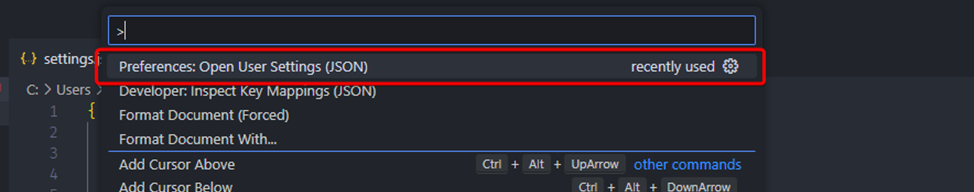
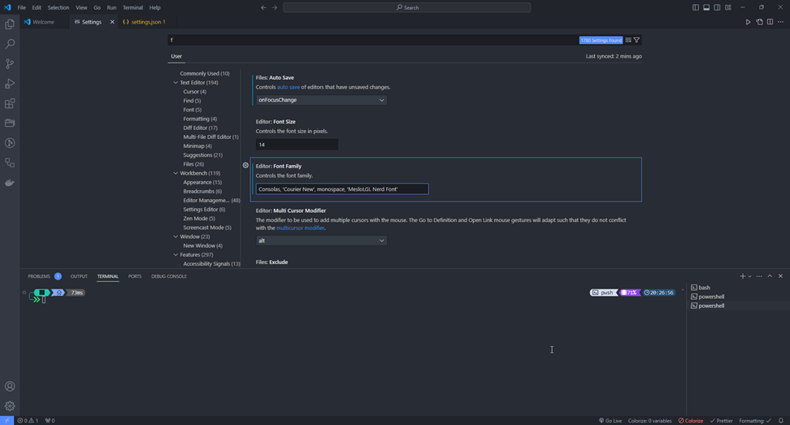
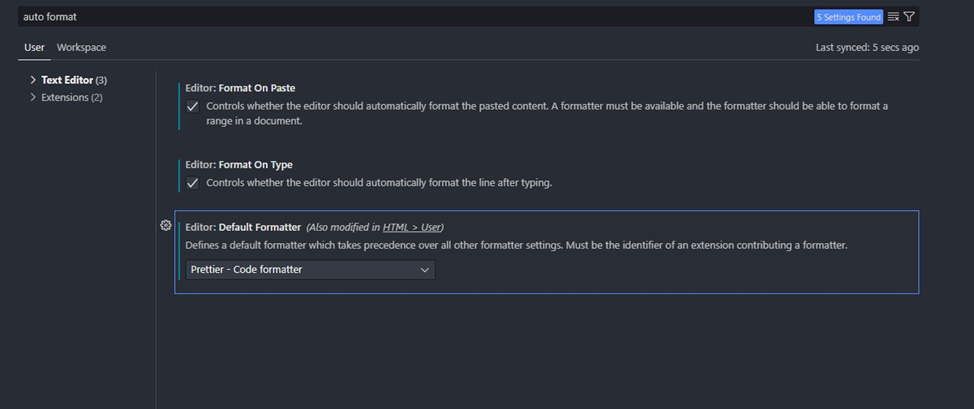
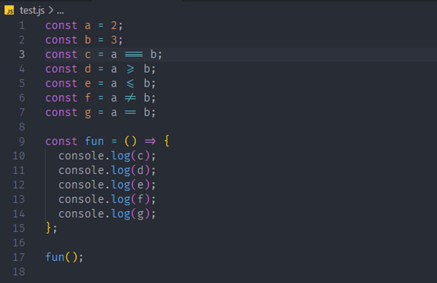

### [ ◀️ Технические гайды и инструкции](../README.md)

# Руководство. По настройке VS Code

### **Оглавление**

- [Руководство. По настройке VS Code](#руководство-по-настройке-vs-code)
  - [**Оглавление**](#оглавление)
  - [**Установка шрифтов для Oh My Posh PowerShell**](#установка-шрифтов-для-oh-my-posh-powershell)
  - [**Настройка Prettier**](#настройка-prettier)
  - [**Расширения (Extensions) для VS Code**](#расширения-extensions-для-vs-code)
  - [**Изменения шрифта для кода на JS**](#изменения-шрифта-для-кода-на-js)

 <!-- разделитель -->

---

## **Установка шрифтов для Oh My Posh PowerShell**

Добавить шрифт `MwsloLGL Nerd Font`
Для применения изменений выполнить шаги:

- Установить шрифты
- `Ctrl+Shift+P` – Для открытия `Command Pallete…`

<div align="center">
  
  <p >Рисунок 1</p>
</div>

- Ввести в строку `Open User Settings (JSON)`
- Добавить строки

```JSON
"terminal.integrated.defaultProfile.windows": "PowerShell",
"terminal.integrated.fontFamily": "MesloLGL Nerd Font"
```

- В примере ниже, выделены отмеченны комментарием `//new string`

```JSON
{
  "files.autoSave": "onFocusChange",
  "workbench.colorTheme": "Atom One Dark",
  "git.autofetch": true,
  "[html]": {
    "editor.defaultFormatter": "esbenp.prettier-vscode"
  },
  "editor.formatOnType": true,
  "editor.formatOnPaste": true,
  "editor.formatOnSave": true,
  "editor.defaultFormatter": "esbenp.prettier-vscode",
  "workbench.iconTheme": "material-icon-theme",
  "terminal.integrated.defaultProfile.windows": "PowerShell",// new string
  "terminal.integrated.fontFamily": "MesloLGL Nerd Font",// new string
  "editor.fontFamily": "'Fira Code', Consolas, 'Courier New', monospace",
  "editor.fontLigatures": true,
  "editor.fontWeight": "300"
}
```

<div align="center">
  
  <p >Рисунок 2</p>
</div>

## **Настройка Prettier**

Выберите VS Code -> View -> Command Palette и введите: Format Document With
Затем Configure Default Formatter... , а затем выберите Prettier - Code formatter .
Это волшебным образом решило для меня проблему.

<div align="center">
  
  <p >Рисунок 3</p>
</div>

## **Расширения (Extensions) для VS Code**

список установленных можно получить командой `code --list-extensions`

- aaron-bond.better-comments
- akamud.vscode-javascript-snippet-pack
- akamud.vscode-theme-onedark
- alefragnani.project-manager
- box-of-hats.bemhelper
- bradlc.vscode-tailwindcss
- cweijan.dbclient-jdbc
- cweijan.vscode-mysql-client2
- dbaeumer.vscode-eslint
- diz.ecsstractor-port
- docker.docker
- dsznajder.es7-react-js-snippets
- eamodio.gitlens
- esbenp.prettier-vscode
- formulahendry.auto-close-tag
- formulahendry.auto-complete-tag
- formulahendry.auto-rename-tag
- formulahendry.code-runner
- github.codespaces
- github.copilot
- github.copilot-chat
- github.vscode-github-actions
- glenn2223.live-sass
- imbhargav5.npm-ui
- kamikillerto.vscode-colorize
- mechatroner.rainbow-csv
- mongodb.mongodb-vscode
- ms-azuretools.vscode-containers
- ms-azuretools.vscode-docker
- ms-vscode-remote.remote-containers
- ms-vscode-remote.remote-wsl
- ms-vscode.cmake-tools
- ms-vscode.cpptools
- ms-vscode.cpptools-extension-pack
- ms-vscode.cpptools-themes
- ms-vscode.powershell
- ms-vscode.vscode-serial-monitor
- mtxr.sqltools
- pkief.material-icon-theme
- pucelle.vscode-css-navigation
- ritwickdey.liveserver
- sdras.vue-vscode-snippets
- tombonnike.vscode-status-bar-format-toggle
- twxs.cmake
- visualstudioexptteam.intellicode-api-usage-examples
- visualstudioexptteam.vscodeintellicode
- vscjava.vscode-java-pack
- vue.volar
- zwsoft.zwlisp

## **Изменения шрифта для кода на JS**

Изменения шрифта на `Fira Code` для изменения стрелок функции и знаков равенства. Пример результата на скрине. До изменения это выглядело так: `===, >=, <=, !=, ==, =>`

<div align="center">
  
  <p >Рисунок 4</p>
</div>

Для применения изменений выполнить шаги:

- Установить шрифты
- `Ctrl+Shift+P` – Для открытия `Command Pallete…`

<div align="center">
  
  <p >Рисунок 5</p>
</div>

- Ввести в строку `Open User Settings (JSON)`
- Добавить в переменную `editor.fontFamily` шрифт `Fira Code` шрифт должен стоять первым в списке шрифтов
- Добавить строки

```json
"editor.fontLigatures": true,
"editor.fontWeight": "300"
```

- В примере ниже, выделены желтым

```json
{
  "files.autoSave": "onFocusChange",
  "workbench.colorTheme": "Atom One Dark",
  "git.autofetch": true,
  "[html]": {
    "editor.defaultFormatter": "esbenp.prettier-vscode"
  },
  "editor.formatOnType": true,
  "editor.formatOnPaste": true,
  "editor.formatOnSave": true,
  "editor.defaultFormatter": "esbenp.prettier-vscode",
  "workbench.iconTheme": "material-icon-theme",
  "terminal.integrated.defaultProfile.windows": "PowerShell",
  "terminal.integrated.fontFamily": "MesloLGL Nerd Font",
  "editor.fontFamily": "'Fira Code', Consolas, 'Courier New', monospace",
  "editor.fontLigatures": true, //new string
  "editor.fontWeight": "300" //new string
}
```
